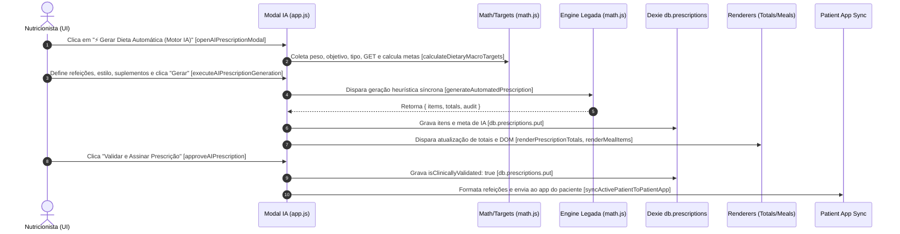

# FASE N3.7.2-A — AUDITORIA DE FRONTEIRA ENTRE RUNTIME LEGADO E DOMÍNIO CANÔNICO

**Data da Auditoria:** 13 de Setembro de 2026  
**Status da Fase:** Homologação Técnica & Mapeamento de Fronteira  
**Escopo:** Mapeamento documental estrito sem alteração de código funcional (Zero Functional Edits).  
**Alvo:** `app.js`, `db.js`, `math.js`, `foodsData.js`, `domain/contracts/`, `domain/orchestration/`.

---

## SUMÁRIO EXECUTIVO & MÉTRICAS DE AUDITORIA

A presente auditoria estabelece a cartografia exata da fronteira arquitetural entre o runtime da aplicação web (`app.js`, `db.js`, `math.js`, `foodsData.js`) e a cadeia de contratos canônicos homologada na Fase N3.7.1 (`prescriptionOrchestrator.js`). 

O objetivo exclusivo é assegurar que a futura camada de adaptação (Subfase N3.7.2-B: `prescriptionInputAdapter` e `prescriptionOutputAdapter`) seja construída sobre as estruturas de dados **REAIS** e comprovadas do sistema, eliminando suposições teóricas, coerções implícitas e riscos de regressão no navegador.

### Contadores Oficiais de Auditoria:
* **Funções Auditadas no Runtime:** `33`
* **Campos Mapeados na Fronteira:** `68`
* **Gaps Identificados (Legado vs Canônico):** `11`
* **Bypasses Mapeados (Mutações fora do Pipeline):** `7`
* **Arquivos Funcionais Modificados:** `0` (Zero)

---

## 1. FLUXO REAL DE GERAÇÃO DE PRESCRIÇÃO

O ciclo de vida de uma prescrição no navegador foi inteiramente rastreado desde a intenção do usuário na interface até a persistência e sincronização em nuvem.



### Detalhamento das Etapas e Funções Envolvidas:

1. **Abertura do Modal de Geração:**
   * **Função:** `openAIPrescriptionModal()` ([app.js:2622-2649](file:///g:/Meu%20Drive/Projetos/Nutri/app.js#L2622-L2649))
   * **Ação:** Coleta peso (`document.getElementById("evalWeight")?.value`), objetivo (`anamneseObjective`), tipo de paciente (`anamnesePatientType`) e GET (`resGet`). Invoca `calculateDietaryMacroTargets(obj, patType, pWeight, getKcal)` ([math.js:1121-1250](file:///g:/Meu%20Drive/Projetos/Nutri/math.js#L1121-L1250)). Exibe os alvos calculados no modal e remove a classe `.hidden` de `aiPrescriptionModal`.

2. **Coleta de Parâmetros pelo Nutricionista:**
   * **Linhas:** [app.js:2652-2665](file:///g:/Meu%20Drive/Projetos/Nutri/app.js#L2652-L2665) em `executeAIPrescriptionGeneration()`
   * **Parâmetros coletados:**
     * `mealCount`: `parseInt(document.getElementById("aiMealCountSelect")?.value || "4", 10)`
     * `dietaryStyle`: `document.getElementById("aiDietaryStyleSelect")?.value || "tradicional"`
     * `includeSupplements`: `document.getElementById("aiIncludeSupplementsCheck")?.checked !== false`

3. **Cálculo de Metas Energéticas e Macrostargets:**
   * **Função:** `calculateDietaryMacroTargets(objective, patientType, weightKg, getKcal)` ([math.js:1121-1250](file:///g:/Meu%20Drive/Projetos/Nutri/math.js#L1121-L1250))
   * **Retorno:** `{ caloricTarget, targetProtG, targetProtKg, targetCarbG, targetCarbKg, targetLipG, targetLipKg, minFiber, deltaKcal, objectiveLabel }`.

4. **Geração e Montagem Heurística da Dieta:**
   * **Função:** `generateAutomatedPrescription(patientProfile, macroTargets, options)` ([math.js:1414-1622](file:///g:/Meu%20Drive/Projetos/Nutri/math.js#L1414-L1622))
   * **Mecanismo:** Seleciona alimentos a partir de uma tabela estática interna `CANONICAL_DIET_FOODS` ([math.js:1366-1405](file:///g:/Meu%20Drive/Projetos/Nutri/math.js#L1366-L1405)). Divide as calorias em blocos fixos por quantidade de refeições (3, 4, 5 ou 6 refeições) usando regras manuais.

5. **Auditoria Bromatológica Imediata:**
   * **Função:** `auditDietBromatology(prescriptionItems)` ([math.js:1279-1353](file:///g:/Meu%20Drive/Projetos/Nutri/math.js#L1279-L1353))
   * **Ação:** Valida a divergência de Atwater entre `kcalFonte` e `(P*4) + (C*4) + (G*9)` em cada item e no total geral da dieta.

6. **Criação do Draft em Memória:**
   * **Linhas:** [app.js:2682-2688](file:///g:/Meu%20Drive/Projetos/Nutri/app.js#L2682-L2688)
   * **Estado:**
     ```javascript
     currentPrescriptionItems = generated.items;
     currentPrescriptionMeta = {
       isAIGenerated: true,
       isClinicallyValidated: false,
       generatedAt: generated.generatedAt,
       validatedAt: null
     };
     ```

7. **Persistência no Dexie:**
   * **Linhas:** [app.js:2690-2695](file:///g:/Meu%20Drive/Projetos/Nutri/app.js#L2690-L2695)
   * **Comando:**
     ```javascript
     await db.prescriptions.put({
       id: activePatientId,
       patientId: activePatientId,
       items: currentPrescriptionItems,
       meta: currentPrescriptionMeta
     });
     ```

8. **Aprovação e Assinatura Clínica:**
   * **Função:** `approveAIPrescription()` ([app.js:2738-2751](file:///g:/Meu%20Drive/Projetos/Nutri/app.js#L2738-L2751))
   * **Ação:** Seta `currentPrescriptionMeta.isClinicallyValidated = true`, `currentPrescriptionMeta.validatedAt = new Date().toISOString()`, regrava em `db.prescriptions.put` e atualiza os banners e badges visuais na UI.

9. **Sincronização com o App do Paciente e Cloud Backup:**
   * **Função 1:** `syncActivePatientToPatientApp(patientId)` ([app.js:10184-10330](file:///g:/Meu%20Drive/Projetos/Nutri/app.js#L10184-L10330)) — Agrupa itens por `mealName`, computa macros da refeição e monta o DTO de visualização do paciente.
   * **Função 2:** `syncActivePatientToGoogleDrive(patientId)` ([app.js:3640-3685](file:///g:/Meu%20Drive/Projetos/Nutri/app.js#L3640-L3685)) — Empacota `currentPrescriptionItems` e envia para o Google Apps Script via formulário oculto/CORS-free.

---

## 2. CONTEXTO DO PACIENTE: ORIGEM REAL E MAPEAMENTO

O runtime obtém informações do paciente de forma híbrida: parte de inputs e elementos do DOM, parte do Dexie (`db.patients`, `db.assessments`, `db.performanceMetabolica`) e parte de variáveis globais em memória.

### Tabela de Mapeamento: Origens do Runtime vs `NutritionPrescriptionContextDTO`

| Campo Canônico (`NutritionPrescriptionContextDTO`) | Origem Real no Runtime Legado | Localização no Código | Tipo no Runtime | Status / GAP |
| :--- | :--- | :--- | :--- | :--- |
| `patient.patientId` | `activePatientId` / `p.id` | `app.js:23, 10185` | `string` | **Equivalente** |
| `patient.name` | `activePatientData.name` / DOM `#headerPatientName` | `app.js:10193, 10200` | `string` | **Equivalente** |
| `patient.age` | `activePatientData.age` / `#evalAge` / `p.birthDate` | `app.js:4062, 17098` | `number` / `string` | **Equivalente** (requer parse int) |
| `patient.sex` | `activePatientData.gender` / `#evalGender` | `app.js:4061, 17105` | `"Masculino"` / `"Feminino"` | **Equivalente** |
| `patient.patientType` | `#anamnesePatientType` / `p.patientType` | `app.js:2529, 2629` | `string` | **Equivalente** |
| `patient.trainingLevel` | `p.trainingLevel` / `perfWorkoutMeta.level` | `app.js:17100` | `string` | **Equivalente** |
| `anthropometry.weightKg` | `#evalWeight` / `#headerPatientInfo` / `db.assessments` | `app.js:2509, 2627, 2653` | `number` / string regex | **Equivalente** |
| `anthropometry.heightCm` | `#evalHeight` / `p.height` / `assessment.height` | `app.js:4063` | `number` (pode ser m ou cm!) | **Exige Transformação** (< 3.0 multiplica por 100) |
| `anthropometry.bodyFatPercent` | `#evalBodyFat` / `assessment.fatPercent` | `app.js:3200, 5100` | `number` | **Equivalente** |
| `anthropometry.leanMassKg` | `assessment.leanMass` | `app.js:5113` | `number` | **Equivalente** |
| `anthropometry.fatMassKg` | `assessment.fatMass` | `app.js:5114` | `number` | **Equivalente** |
| `latestAssessment` | `db.assessments.where("patientId").equals().toArray()` | `app.js:5092-5095` | `Array<Object>` ordenado | **Equivalente** |
| `energy.tmbKcal` | `tmbResult.tmb` em `buildPerformanceContext` | `app.js:17210` | `number` | **Equivalente** |
| `energy.getKcal` | `#resGet` / `calculateGET()` | `app.js:2530, 2630, 17211` | `number` | **Equivalente** |
| `objective.category` | `#anamneseObjective` / `p.objective` | `app.js:2528, 2628` | `string` livre | **Exige Transformação** (Mapear texto para enum canônico) |
| `routine.wakeUpTimeMinutes` | `#anamneseWakeTime` / `p.routine?.wakeTime` | `app.js:860` (adapter N1.1) | `"HH:MM"` ou ausente | **Exige Transformação** (Parse para minutos) |
| `routine.bedTimeMinutes` | `#anamneseSleepTime` / `p.routine?.sleepTime` | `app.js:860` (adapter N1.1) | `"HH:MM"` ou ausente | **Exige Transformação** (Parse para minutos) |
| `preferences.mealFrequency` | `#aiMealCountSelect` / `p.mealFrequency` | `app.js:2662` | `string` / `number` (ex: "4") | **Equivalente** |
| `training.scheduledWorkouts` | `perfWorkoutPlan` / `perfWeeklySchedule` | `app.js:10276, 10315` | `Array<Object>` | **Equivalente** |
| `training.periWorkoutWindowMinutes`| Inexistente no runtime | - | - | **GAP CLÍNICO 1** (Não há conceito de janela no runtime) |
| `mealRole` (`PRIMARY`, `SNACK`, etc.) | Inexistente no runtime | - | - | **GAP CLÍNICO 2** (Refeições são apenas rótulos nominais) |
| `fasting.isFastingPrescription` | `db.fastingProtocols` (módulo isolado) | `fasting-module.js` | `Object` | **GAP CLÍNICO 3** (Desconectado da prescrição principal) |

---

## 3. ESTRUTURA REAL DOS ALIMENTOS

### 3.1. Catálogo Geral: `COMPREHENSIVE_TACO_TBCA_FOODS` (`foodsData.js`)
O catálogo oficial é um array global composto por **3.034 alimentos** padronizados na base centesimal (100g ou 100ml):

```javascript
// Exemplo real extraído de foodsData.js (linhas 6-29)
{
  "id": "FOOD_0001",
  "name": "Café sem açúcar",
  "category": "Achocolatados e Bebidas",
  "source": "TACO",
  "baseQuantity": 100,
  "unit": "g",
  "prepState": "Preparado",
  "calories": 2,
  "protein": 0.3,
  "carbohydrate": 0,
  "lipid": 0,          // ATENÇÃO: Chama-se "lipid", NÃO "fat"!
  "fiber": 0,
  "sodium": 1,
  "bromatology": {
    "atwaterKcal": 1.2,
    "diffKcal": 0.8,
    "diffPct": 40,
    "massSum": 0.3,
    "massStatus": "OK",
    "energyStatus": "INCONSISTENTE",
    "sourceStatus": "OK"
  }
}
```

### 3.2. Catálogo Heurístico Legado: `CANONICAL_DIET_FOODS` (`math.js`)
Dicionário estático de 25 alimentos hardcoded utilizado pelo gerador heurístico `generateAutomatedPrescription`:

```javascript
// Exemplo real extraído de math.js (linhas 1368-1373)
frango_grelhado: {
  name: "Peito de Frango (Grelhado)",
  source: "TACO",
  prepState: "Grelhado",
  category: "Carnes e Aves",
  calories: 159.0,
  protein: 32.0,
  carbohydrate: 0.0,
  lipid: 2.5,
  fiber: 0.0,
  sodium: 50.0,
  defaultUnit: "file",
  gramPerUnit: 100
}
```

### 3.3. Confronto com o Contrato Canônico `FoodSolverContract` (`CanonicalFoodDTO`)

| Propriedade Canônica (`CanonicalFoodDTO`) | Propriedade em `foodsData.js` | Propriedade em `math.js` | Compatibilidade com `validateCanonicalFoodDTO` |
| :--- | :--- | :--- | :--- |
| `id` / `foodId` (string obrigatória) | `id: "FOOD_XXXX"` | Chave do objeto (ex: `frango_grelhado`) | **foodsData:** COMPATÍVEL<br>**math.js:** GAP (exige atribuição de `id`) |
| `name` / `foodName` (string obrigatória) | `name: string` | `name: string` | **100% COMPATÍVEL** |
| `baseQuantity` (número finito > 0) | `baseQuantity: 100` | Implícito 100 (não declarado) | **foodsData:** COMPATÍVEL<br>**math.js:** Requer default 100 |
| `unit` / `baseUnit` ("g" ou "ml") | `unit: "g" \| "ml"` | Ausente (possui `defaultUnit: "file"`) | **foodsData:** COMPATÍVEL<br>**math.js:** Requer normalização para "g" |
| `calories` (número >= 0) | `calories: number` | `calories: number` | **100% COMPATÍVEL** |
| `protein` (número >= 0) | `protein: number` | `protein: number` | **100% COMPATÍVEL** |
| `carbohydrate` (número >= 0) | `carbohydrate: number` | `carbohydrate: number` | **100% COMPATÍVEL** |
| `lipid` (número >= 0) | `lipid: number` | `lipid: number` | **100% COMPATÍVEL** |
| `fiber` (número >= 0 ou null) | `fiber: number` | `fiber: number` | **100% COMPATÍVEL** |
| `sodium` (número >= 0 ou null) | `sodium: number` | `sodium: number` | **100% COMPATÍVEL** |
| `category`, `source`, `prepState` | Strings presentes | Strings presentes | **100% COMPATÍVEL** |
| `bromatology` (objeto) | Presente | Ausente | **foodsData:** Preserva auditoria centesimal |

> **Conclusão:** O catálogo de `foodsData.js` atende perfeitamente a todos os requisitos de `validateCanonicalFoodDTO()`. Já o dicionário de `math.js` é um subconjunto legado sem identificadores estáveis.

---

## 4. ESTRUTURA REAL DA PRESCRIÇÃO LEGADA

### 4.1. Registro Persistido no Dexie (`db.prescriptions`)
Diferente do que sugeriria o nome `prescriptions`, o Dexie armazena **um único objeto agregado por paciente** (keyed por `patientId`), contendo uma lista plana de itens desnormalizados:

```javascript
// Objeto Real gravado por executeAIPrescriptionGeneration (app.js:2690)
{
  id: "paciente_vitor_123",        // Chave primária = activePatientId
  patientId: "paciente_vitor_123",
  items: [
    {
      id: "ai_item_1726251234567_1",
      foodId: "FOOD_0120",          // Pode ser null em itens inseridos via math.js
      foodName: "Peito de Frango (Grelhado)",
      mealName: "Almoço",           // "Café da manhã", "Lanche manhã", "Almoço", "Jantar", etc.
      mealTime: "12:30",            // String HH:MM
      quantity: 150,                // Quantidade em gramas efetivas
      unit: "g",                    // Sempre "g" na quantidade final
      unitDisplay: "1.5 filé (150g)",// Rótulo para visualização humana
      originalQty: 1.5,             // Medida caseira informada pelo usuário
      originalUnit: "file",         // Medida caseira ("file", "col_sopa", "unid", "scoop")
      baseQuantity: 100,            // Base centesimal de referência
      baseUnit: "g",
      kcalPer100: 159.0,
      protPer100: 32.0,
      carbPer100: 0.0,
      lipidPer100: 2.5,
      fiberPer100: 0.0,
      sodiumPer100: 50.0,
      calories: 238.5,              // Calorias escaladas para quantity
      protein: 48.0,                // Proteínas escaladas
      carbohydrate: 0.0,            // Carboidratos escalados
      lipid: 3.75,                  // Lipídios escalados (CAMPO CHAVE: "lipid", NUNCA "fat")
      fiber: 0.0,
      source: "TACO",
      prepState: "Grelhado",
      category: "Carnes e Aves"
    }
    // ... demais itens de todas as refeições
  ],
  meta: {
    isAIGenerated: true,
    isClinicallyValidated: false,
    generatedAt: "2026-09-13T16:45:00.000Z",
    validatedAt: null
  }
}
```

### 4.2. Incoerências Críticas de Nomenclatura no Legado:
1. **Item individual:** utiliza `lipid`, `lipidPer100`, `carbohydrate`, `carbPer100`.
2. **Totais de cálculo (`renderPrescriptionTotals`):** utiliza `lipid`, `carb`, `protein`, `kcal`.
3. **Labels de meta no DOM:** utiliza `targetLipG`, `targetCarbG`, `targetProtG`, `caloricTarget`.
4. **Card de resultado por kg:** utiliza `lipKg`, `carbKg`, `protKg`.
5. **Patient App (`syncActivePatientToPatientApp`):** na montagem de `formattedMeals`, transforma `lipid` em `fat`, e `carbohydrate` em `carbo`:
   ```javascript
   // app.js linha 10270
   fat: Math.round(m.lipid),
   carbo: Math.round(m.carbo)
   ```

---

## 5. AUDITORIA DEXIE (`db.prescriptions`)

* **Schema Declarado em `db.js`:**
  ```javascript
  // db.js linhas 13, 26, 40, 54
  prescriptions: "id, patientId"
  prescriptionItems: "id, prescriptionId, foodName" // TABELA MORTA (nunca utilizada no runtime)
  ```
* **Chave Primária:** `id` (que no runtime assume exatamente o valor de `patientId`).
* **Índice Secundário:** `patientId`.

### Pontos de Leitura de `db.prescriptions`:
1. `loadPrescriptionForPatient(patientId)` ([app.js:2991](file:///g:/Meu%20Drive/Projetos/Nutri/app.js#L2991)):
   `const saved = await db.prescriptions.get(patientId);`
2. `buildPerformanceContext(pId)` ([app.js:17219](file:///g:/Meu%20Drive/Projetos/Nutri/app.js#L17219)):
   `if (db.prescriptions) prescRecord = await db.prescriptions.get(pId);`
3. `resultsCalculateMetrics(patientId)` ([app.js:5097](file:///g:/Meu%20Drive/Projetos/Nutri/app.js#L5097)):
   `const prescription = await db.prescriptions.where("patientId").equals(patientId).first();`

### Pontos de Escrita de `db.prescriptions`:
1. `handleAddPrescriptionItem()` ([app.js:2351](file:///g:/Meu%20Drive/Projetos/Nutri/app.js#L2351))
2. `removePrescriptionItem()` ([app.js:2365](file:///g:/Meu%20Drive/Projetos/Nutri/app.js#L2365))
3. `saveEditPrescriptionItem()` ([app.js:2489](file:///g:/Meu%20Drive/Projetos/Nutri/app.js#L2489))
4. `executeAIPrescriptionGeneration()` ([app.js:2690](file:///g:/Meu%20Drive/Projetos/Nutri/app.js#L2690))
5. `approveAIPrescription()` ([app.js:2742](file:///g:/Meu%20Drive/Projetos/Nutri/app.js#L2742))
6. `clearPrescriptionDiet()` ([app.js:2970](file:///g:/Meu%20Drive/Projetos/Nutri/app.js#L2970))
7. `loadPatientFromCloud()` ([app.js:3762](file:///g:/Meu%20Drive/Projetos/Nutri/app.js#L3762))
8. `loadPatientFromDriveByFileName()` ([app.js:3905](file:///g:/Meu%20Drive/Projetos/Nutri/app.js#L3905))
9. `saveNewPatient()` ([app.js:4051](file:///g:/Meu%20Drive/Projetos/Nutri/app.js#L4051)) — Executa `delete(id)`.

> **Vulnerabilidade Estrutural do Dexie Detectada:**  
> Nas chamadas 1, 2, 3, 7 e 8, o comando é executado como `db.prescriptions.put({ id, patientId, items: currentPrescriptionItems })` **SEM passar a propriedade `meta`**. Isso significa que qualquer edição manual, adição ou remoção de alimento **DELETA silenciosamente o objeto `meta`**, destruindo o status de validação clínica e a rastreabilidade da IA.

---

## 6. FLUXO DE SAÍDA: EXPECTATIVAS DO RUNTIME

Para que uma prescrição gerada pelo pipeline canônico N3.7.1 seja aceita e consumida pelo runtime sem quebras visuais ou lógicas, a camada de saída deve entregar:

1. **Estrutura de Itens Plana (`currentPrescriptionItems`):**
   * Array de itens contendo as propriedades centesimais escaladas: `calories`, `protein`, `carbohydrate`, `lipid`, `fiber`, `sodium`.
   * Campos de agrupamento visual: `mealName` (string nominal), `mealTime` (string `"HH:MM"`).
   * Referência ao alimento: `foodId`, `foodName`, `quantity`, `unit: "g"`, `unitDisplay`.

2. **Estrutura de Metadados (`currentPrescriptionMeta`):**
   * `isAIGenerated: true`
   * `isClinicallyValidated: boolean` (false por padrão até aprovação)
   * `generatedAt: string` (ISO timestamp)
   * `validatedAt: string | null`
   * **Extensões Canônicas da N3.7:**
     * `validationVerdict`: `'PASS' | 'WARNING' | 'BLOCKED'`
     * `validationStatus`: `'VALID' | 'WARNING' | 'BLOCKED' | 'INVALID'`
     * `validationScore`: `number` (0 a 100)
     * `violations`: `Array<Object>`
     * `pipelineSummary`: `string`

3. **Gatilhos de UI Obrigatórios no Runtime:**
   Após a entrega do DTO adaptado, o runtime precisa invocar sequencialmente:
   * `updateAIPrescriptionBanner()` ([app.js:2705](file:///g:/Meu%20Drive/Projetos/Nutri/app.js#L2705))
   * `renderPrescriptionTotals()` ([app.js:2497](file:///g:/Meu%20Drive/Projetos/Nutri/app.js#L2497))
   * `renderMealItems()` ([app.js:3004](file:///g:/Meu%20Drive/Projetos/Nutri/app.js#L3004))
   * `syncActivePatientToPatientApp(activePatientId)` ([app.js:10184](file:///g:/Meu%20Drive/Projetos/Nutri/app.js#L10184))
   * `renderAdherenceDashboard(activePatientId)` ([app.js:9010](file:///g:/Meu%20Drive/Projetos/Nutri/app.js#L9010))

---

## 7. MAPA COMPLETO DE BYPASSES DA PRESCRIÇÃO

Foram mapeadas **7 operações reais** no runtime que mutam ou substituem a prescrição dietética fora do pipeline orquestrado:

| # | Operação | Função Envolvida | Arquivo & Linhas | Tipo de Mutação | Momento em relação à Validação | Exigirá Invalidação Futura do N3.6? |
| :-: | :--- | :--- | :--- | :--- | :--- | :--- |
| **B1** | Adicionar Alimento Manual | `handleAddPrescriptionItem()` | `app.js:2306-2361` | Inserção direta no array + `db.put` | Ocorre a qualquer momento na UI | **SIM (CRÍTICO)** — Altera macros e calorias; apaga `meta`. |
| **B2** | Remover Alimento | `removePrescriptionItem(id)` | `app.js:2363-2369` | Filtro direto no array + `db.put` | Ocorre a qualquer momento na UI | **SIM (CRÍTICO)** — Reduz macros; quebra metas; apaga `meta`. |
| **B3** | Editar Alimento / Quantidade / Horário | `saveEditPrescriptionItem()` | `app.js:2397-2495` | Mutação in-place de gramas/horário + `db.put` | Ocorre a qualquer momento na UI | **SIM (CRÍTICO)** — Pode desbalancear Atwater e janelas temporais. |
| **B4** | Limpar Dieta Completa | `clearPrescriptionDiet()` | `app.js:2959-2980` | Zera o array (`items: []`) + `db.put` | Ação explícita do nutricionista | **NÃO** — Dieta é esvaziada por intenção deliberada. |
| **B5** | Importar Paciente da Nuvem (Google Drive) | `loadPatientFromCloud()` | `app.js:3760-3765` | Sobrescreve `currentPrescriptionItems` + `db.put` | Importação remota de backup | **SIM (ALTO)** — Itens restaurados sem `meta` e sem validação N3.6. |
| **B6** | Carregar Backup Específico do Drive | `loadPatientFromDriveByFileName()` | `app.js:3903-3907` | Sobrescreve `currentPrescriptionItems` + `db.put` | Importação seletiva de arquivo | **SIM (ALTO)** — Itens restaurados sem `meta` e sem validação N3.6. |
| **B7** | Aprovação Clínica Sem Revalidação | `approveAIPrescription()` | `app.js:2738-2751` | Seta `isClinicallyValidated = true` + `db.put` | Clique em botão após geração | **SIM (GRAVE)** — Atualmente aprova qualquer dieta, mesmo se BLOCKED! |

---

## 8. TABELA DOCUMENTAL DE MAPEAMENTO: LEGADO → CANÔNICO

Esta tabela é **estritamente documental**. Nenhuma transformação de código foi implementada nesta fase.

| Campo Legado (Runtime) | Campo Canônico (Domínio N3.7.1) | Categoria da Relação | Regra de Mapeamento Documental |
| :--- | :--- | :--- | :--- |
| `pWeight` / `#evalWeight` | `anthropometry.weightKg` | **Equivalente** | Conversão direta via `Number(val)`. |
| `p.height` / `#evalHeight` | `anthropometry.heightCm` | **Exige Transformação** | Se `val < 3.0`, multiplicar por 100; senão `val`. |
| `anamneseObjective` | `objective.category` | **Exige Transformação** | Mapear strings livres (ex: "Hipertrofia e definição") para enum canônico. |
| `anamnesePatientType` | `patient.patientType` | **Equivalente** | Normalização de string trim. |
| `resGet` | `energy.getKcal` | **Equivalente** | `Math.round(Number(val))`. |
| `caloricTarget` (math.js) | `energyTargetResult.caloricTargetKcal` | **Equivalente** | `Number(val)`. |
| `targetProtG` (math.js) | `macroDistributionResult.proteinTargetG` | **Equivalente** | `Number(val)`. |
| `targetCarbG` (math.js) | `macroDistributionResult.carbohydrateTargetG` | **Equivalente** | `Number(val)`. |
| `targetLipG` (math.js) | `macroDistributionResult.fatTargetG` | **Equivalente com Nomenclatura Distinta** | Legado chama de Lipídios (`targetLipG`); domínio chama de Gordura (`fatTargetG`). |
| `minFiber` (math.js) | `macroDistributionResult.fiberTargetG` | **Equivalente** | `Number(val)`. |
| `food.id` (foodsData.js) | `food.id` (CanonicalFoodDTO) | **Equivalente** | `String(id).trim()`. |
| `food.lipid` (foodsData.js) | `food.lipid` (CanonicalFoodDTO) | **Equivalente** | Suportado nativamente no contrato `FoodSolverContract`. |
| `item.mealName` | `meal.mealName` | **Equivalente** | Identificador de rótulo nominal da refeição. |
| `item.mealTime` (`"12:30"`) | `meal.scheduledTimeMinutes` (`750`) | **Exige Transformação** | Legado usa string `"HH:MM"`; domínio usa minutos inteiros desde 00:00 (`(H * 60) + M`). |
| `item.quantity` | `item.portionGrams` | **Equivalente** | Gramagem calculada. |
| `item.calories` | `item.nutrients.calories` | **Equivalente** | Energia escalada. |
| `item.protein` | `item.nutrients.protein` | **Equivalente** | Proteína escalada. |
| `item.carbohydrate` | `item.nutrients.carbohydrate` | **Equivalente** | Carboidrato escalado. |
| `item.lipid` | `item.nutrients.fat` | **Equivalente com Nomenclatura Distinta** | No item legado é `lipid`; no contrato de item canônico N3.3 é `fat`. |
| `item.fiber` | `item.nutrients.fiber` | **Equivalente** | Fibra escalada. |
| *Inexistente no Legado* | `meal.mealRole` | **Campo Ausente (GAP)** | O legado não classifica refeições em `PRIMARY`, `SECONDARY`, `SNACK`. Deve ser inferido pelo Input Adapter ou alocado por política. |
| *Inexistente no Legado* | `preferredPeriEventWindowMinutes` | **Campo Ausente (GAP)** | Deve assumir a constante canônica de 120 min (natureza PREFERRED). |
| *Inexistente no Legado* | `validationReport` / `violations` | **Campo Ausente (GAP)** | O legado grava apenas status booleano. Deve ser acoplado via `prescriptionOutputAdapter`. |

---

## 9. PROPOSTA DE FRONTEIRA DE ADAPTAÇÃO (ADAPTER BOUNDARY)

A separação de responsabilidades para a Subfase N3.7.2-B fica formalmente estabelecida:

```text
┌─────────────────────────────────────────────────────────────────────────┐
│                        LEGADO / NAVEGADOR                               │
│  (app.js, db.js, foodsData.js, DOM, LocalStorage, Firebase, Drive)      │
└──────────────────┬──────────────────────────────────────▲───────────────┘
                   │                                      │
         [Dados Brutos / Dexie]              [currentPrescriptionItems / Meta]
                   │                                      │
                   ▼                                      │
┌─────────────────────────────────────┐  ┌────────────────────────────────┐
│      prescriptionInputAdapter       │  │   prescriptionOutputAdapter    │
│  - Resolve Dexie / DOM              │  │  - Achata Meals em Items       │
│  - Constrói ContextDTO (N1.1)       │  │  - Converte minutos em "HH:MM" │
│  - Constrói CanonicalFoodDTO[]      │  │  - Converte 'fat' em 'lipid'   │
│  - Mapeia Objetivos e Refeições     │  │  - Formata Banner & Badges N3.6│
└──────────────────┬──────────────────┘  └────────────────▲───────────────┘
                   │                                      │
       [ContextDTO + FoodCatalog]           [PipelineResultDTO (N3.7.1)]
                   │                                      │
                   ▼                                      │
┌─────────────────────────────────────────────────────────┴───────────────┐
│                    DOMÍNIO CANÔNICO PURO (N3.7.1)                       │
│                   prescriptionOrchestrator.js                           │
│  (N1.1 → N2.1 → N2.2 → N2.3 → N3.2 → N3.3 → N3.4 → N3.5 → N3.6)         │
└─────────────────────────────────────────────────────────────────────────┘
```

### A. Responsabilidades do `prescriptionInputAdapter`:
1. Coleta puramente os registros de `db.patients`, `db.assessments`, `db.performanceMetabolica` e parâmetros do modal.
2. Invoca o `nutritionContextAdapter.buildNutritionPrescriptionContext()` para produzir o `NutritionPrescriptionContextDTO` imutável.
3. Converte o catálogo `COMPREHENSIVE_TACO_TBCA_FOODS` de `foodsData.js` em uma coleção validada de `CanonicalFoodDTO[]` via `createCanonicalFoodDTO()`.
4. Constrói o objeto canônico `options` com `mealCount`, `dietaryStyle`, e mapeamento de `mealRole`.
5. Garante validação pré-voo: se dados essenciais estiverem corrompidos, rejeita antes de chamar o orquestrador.

### B. Responsabilidades do `prescriptionOutputAdapter`:
1. Recebe o `PrescriptionPipelineResultDTO` puro produzido por `executePrescriptionPipelineSync()`.
2. Extrai as refeições de `result.mealTimingResult.meals` (ou `result.mealAssemblyResult.meals`).
3. Achata a hierarquia de refeições/alimentos no array linear `currentPrescriptionItems` exigido pelo runtime, gerando IDs estáveis (`ai_item_...`), unidades caseiras e fatores centesimais.
4. Converte `fat` de volta para `lipid` nos itens legados, prevenindo quebras em `renderPrescriptionTotals` e `renderMealItems`.
5. Converte `scheduledTimeMinutes` (ex: 750) na representação textual `"HH:MM"` (ex: `"12:30"`).
6. Constrói o objeto `currentPrescriptionMeta` enriquecido com o veredito do N3.6 (`PASS`, `WARNING` ou `BLOCKED`), o score de validação, violations e trace.
7. Fornece helpers seguros para gravação no Dexie sem deleção acidental de metadados.

---

## 10. MATRIZ DE RISCOS DA INTEGRAÇÃO

| # | Risco Identificado | Severidade | Causa Raiz | Estratégia de Mitigação na N3.7.2-B |
| :-: | :--- | :--- | :--- | :--- |
| **R1** | Quebra de Renderização por divergência `lipid` vs `fat` | **CRÍTICA** | O domínio canônico adota `fat` no assembly N3.3; a UI do runtime e `renderMealItems` somam `item.lipid`. Se faltar `lipid`, calorias e gorduras ficam `NaN` na UI. | O `prescriptionOutputAdapter` deve obrigatoriamente preencher tanto `lipid` quanto `fat` em cada item desnormalizado. |
| **R2** | Deleção silenciosa de `meta` no Dexie | **ALTA** | Funções manuais (`handleAddPrescriptionItem`, etc.) gravam apenas `{ id, patientId, items }`. | Centralizar todas as gravações no Dexie através de um helper seguro no adapter de saída que preserva o `meta` existente. |
| **R3** | Incoerência de Atwater após edição manual | **ALTA** | O nutricionista edita a gramagem na interface legada (Bypass B3). O N3.6 validou a dieta original, mas a versão editada nunca passa por validação global. | Criar gatilho de revalidação imediata: qualquer mutação manual marca `isClinicallyValidated = false` e recalcula o N3.6. |
| **R4** | Perda de Metadados na sincronização com Google Drive | **MÉDIA** | `payload.prescriptions` no sync do Drive exporta apenas `currentPrescriptionItems`, descartando `meta`. | Adicionar `prescriptionMeta: currentPrescriptionMeta` no payload de sincronização do Drive. |
| **R5** | Formato de Horário (String vs Minutos) | **MÉDIA** | Domínio canônico N3.4 opera com minutos inteiros (0 a 1439). O runtime espera strings `"HH:MM"`. | Funções de conversão bidirecionais puras: `timeStringToMinutes(str)` e `minutesToTimeString(num)`. |
| **R6** | Aprovação de Prescrição com status `BLOCKED` | **CRÍTICA** | No runtime legado, o botão "Validar e Assinar Prescrição" é apenas visual e não consulta nenhum gate de segurança. | Desabilitar e bloquear o botão de aprovação sempre que `validationVerdict === 'BLOCKED'`. |

---

## 11. LISTA EXATA DE ARQUIVOS PARA A SUBFASE N3.7.2-B

Para a implementação da Subfase N3.7.2-B, os seguintes arquivos deverão ser criados/modificados:

### Arquivos a Criar (Novos):
1. `domain/adapters/prescriptionInputAdapter.js`  
   * Converte runtime legado / Dexie / foodsData em `NutritionPrescriptionContextDTO`, `CanonicalFoodDTO[]` e opções do pipeline.
2. `domain/adapters/prescriptionOutputAdapter.js`  
   * Converte `PrescriptionPipelineResultDTO` da N3.7.1 na estrutura consumível pelo runtime (`currentPrescriptionItems`, `currentPrescriptionMeta`, badges N3.6).
3. `tests/prescription-input-adapter.test.js`  
   * Bateria de testes unitários cobrindo todos os cenários de normalização, gaps, fallbacks seguros e rejeições de dados corrompidos.
4. `tests/prescription-output-adapter.test.js`  
   * Bateria de testes unitários cobrindo o achatamento de refeições, conservação de nutrientes, aliases `lipid`/`fat`, conversão temporal e metadados N3.6.

### Arquivo a Atualizar:
1. `domain/adapters/index.js`  
   * Exportação dos novos adapters para consumo unificado (CommonJS e browser global `window.NutriDomain.adapters`).

> **Restrição de Fase:** Durante a N3.7.2-B, `app.js` e a interface HTML permanecerão intocados até que os adapters estejam 100% testados e homologados isoladamente.
