# N3.7 — RELATÓRIO DE AUDITORIA FORENSE CLÍNICA E ARQUITETURAL
## Divergência entre Cálculo Energético (Tela A), Prescrição Nutricional (Tela B), Laudo em PDF e Pipeline Canônico (N1.1 → N3.6)

**Data da Auditoria:** 14 de Setembro de 2026  
**Ambiente:** NutriAx Pro — Dark Titanium Medical Edition  
**Escopo:** Investigação forense estrita, rastreamento de variáveis, auditoria de fórmulas, classificação de fontes de verdade e verificação de invariantes (Zero Functional Edits).  
**Alvos Investigados:** `app.js`, `math.js`, `pro/index.html`, `domain/math/`, `domain/adapters/`, `domain/solver/`, `domain/validation/`, `domain/orchestration/`.

---

## 1. RESUMO EXECUTIVO

A presente perícia técnica investigou e rastreou minuciosamente o ecossistema de cálculos metabólicos, prescrição dietética, interface de usuário (UI) e emissão de laudo em PDF para o perfil de paciente masculino de **116,1 kg**, cujo histórico apresentou três representações aparentemente antagônicas:

* **Tela A (Avaliação Antropométrica):** TMB Katch = 2468,01 kcal/dia | FA = 1,57 | GET = 3874,78 kcal/dia | Alvo Calórico = 3407 kcal/dia.
* **Tela B (Prescrição & Macros na UI):** GET = 4208 kcal | Alvo Calórico = 3658 kcal | Metas: P: 232 g (2,00 g/kg), C: 487 g (4,19 g/kg), G: 87 g (0,75 g/kg), Fibra: ≥51 g/dia. Dieta Planejada Atual: 2530 kcal (P: 245 g, C: 267 g, G: 53 g, Fibra: 29 g).
* **PDF (Plano Nutricional & Laudo Clínico):** TMB = 2468 kcal | FA = 1,57 | GET = 3875 kcal | Alvo Energético Prescrito = 3325 kcal | Metas: P: 255 g (2,20 g/kg), C: 381 g (3,28 g/kg), G: 87 g (0,75 g/kg), Fibra: ≥47 g/dia. Plano alimentar total: 2530 kcal (P: 245,5 g, C: 267,3 g, G: 53,4 g).

### Conclusão Pericial Preliminar:
**Nenhum dos valores observados resulta de erro aleatório, corrupção de memória ou falha de ponto flutuante.** Todos os números são estritamente explicáveis e reproduzíveis até a última casa decimal. A divergência manifestada no sistema decorre da sobreposição de **três causas raízes independentes**:

1. **Acoplamento Inadequado da Interface com o DOM (`#resGet` Stale):** A Tela B (barra de totais da prescrição) não consome dados do paciente do banco de dados nem do pipeline canônico; ela realiza leitura direta de elementos textuais do HTML (`document.getElementById("resGet")?.innerText`). Como o arquivo estático `pro/index.html` continha o valor demonstrativo legado `4207.83` (arredondado para **4208 kcal**), a Tela B computou as metas de macros com base nesse GET fantasma antes da aba de avaliação ser recalculada.
2. **Fragmentação de Algoritmos de Meta Energética (Três Fórmulas Diferentes):**
   * A Tela A utilizou a fórmula ad-hoc de `app.js` (L2234): `GET - 468 = 3407 kcal`.
   * A Tela B utilizou a fórmula de `math.js` (L1100) com GET de 4208: `4208 - 550 = 3658 kcal`.
   * O PDF recalculou tudo isoladamente a partir do Dexie com GET de 3875: `3875 - 550 = 3325 kcal`.
   * O motor canônico N2.1 (`domain/math/energyTarget.js`), por sua vez, teria calculado `3875 × (1 - 0.20) = 3100 kcal`.
3. **Descompasso entre Metas Clínicas e Dieta Real Pós-Edição Manual (2530 kcal):** Os **2530 kcal** (P: 245,5 g, C: 267,3 g, G: 53,4 g) representam a soma centesimal direta dos alimentos efetivamente salvos em `currentPrescriptionItems`. O nutricionista realizou ajustes e reduções manuais na dieta após a geração inicial. Tanto a Tela B quanto o PDF somaram fielmente os alimentos do cardápio real (2530 kcal), mas ambos exibiram essa dieta confrontada com metas clínicas calculadas em momentos e contextos distintos.

---

## 2. TABELA FORENSE DE ORIGEM DE CADA VALOR

| Grandeza Observada | Valor Apresentado | Variável Exata no Código | Arquivo Fonte | Função Responsável | Linha Real | Origem dos Dados | Fórmula / Expressão Aplicada | Classificação de Origem |
| :--- | :---: | :--- | :--- | :--- | :---: | :--- | :--- | :--- |
| **Peso do Paciente** | `116,1 kg` | `weight` / `pWeight` | `app.js` | `updateEvaluationCalculations` / `renderPrescriptionTotals` | L2184, L2675 | DOM `#evalWeight` / Dexie `p.currentWeight` | Input direto do usuário | **CANÔNICA (ESTADO)** |
| **Massa Magra (MLG)** | `97,13 kg` | `bodyComp.leanMassKg` | `app.js` / `math.js` | `calculateBodyComposition` | `app.js`: L2209; `math.js`: L130 | Dobras cutâneas no DOM / Dexie `lastEval.leanMass` | `weight * (1 - fatPercent / 100)` | **DERIVADA** |
| **TMB (Tela A)** | `2468,01 kcal` | `tmbData.tmb` | `math.js` | `calculateTMB` | L42-44 | Massa Magra (97,13 kg) | `370 + (21.6 * 97.13) = 2468.01` | **LEGADA (APRESENTAÇÃO)** |
| **TMB (PDF)** | `2468 kcal` | `tmb` | `app.js` | `exportPrescriptionAndEvaluationPDF` | L3474 | Dexie `lastEval.leanMass` (97,13 kg) | `Math.round(370 + 21.6 * leanMass)` | **RECALCULADA (PDF)** |
| **FA (Tela A & PDF)**| `1,57` | `actFactor` | `app.js` | `updateEvaluationCalculations` / `export...PDF` | L2188, L3456 | DOM `#evalActivityFactor` / Dexie `p.activityFactor` | Valor selecionado na avaliação | **PERSISTIDA / EDITÁVEL** |
| **GET (Tela A)** | `3874,78 kcal`| `getKcal` | `math.js` | `calculateGET` | L70-71 | `tmbData.tmb` (2468,01) × FA (1,57) | `Number((2468.01 * 1.57).toFixed(2))` | **LEGADA (APRESENTAÇÃO)** |
| **GET (PDF)** | `3875 kcal` | `getKcal` | `app.js` | `exportPrescriptionAndEvaluationPDF` | L3475 | `tmb` (2468) × `actFactor` (1,57) | `Math.round(2468 * 1.57) = 3875` | **RECALCULADA (PDF)** |
| **GET (Tela B)** | `4208 kcal` | `getKcal` / `macroTargets.getKcal` | `app.js` / `math.js` | `renderPrescriptionTotals` / `calculateDietaryMacroTargets`| `app.js`: L2696; `math.js`: L1146 | DOM `#resGet.innerText` (`4207.83`) | `Math.round(parseFloat("4207.83"))` | **CONFLITANTE (DOM STALE)** |
| **Alvo (Tela A)** | `3407 kcal` | `caloricTarget` | `app.js` | `updateEvaluationCalculations` | L2234 | `getKcal` (3874,78) da Tela A | `Math.round(3874.78 - 468) = 3407` | **LEGADA (NÚMERO MÁGICO)**|
| **Alvo (Tela B)** | `3658 kcal` | `macroTargets.caloricTarget` | `math.js` | `calculateDietaryMacroTargets` | L1100 | `getKcal` (4208) lido do DOM `#resGet` | `Math.round(4208 - 550) = 3658` (peso > 90) | **DERIVADA DE DADO FANTASMA**|
| **Alvo (PDF)** | `3325 kcal` | `macroTargets.caloricTarget` | `math.js` | `calculateDietaryMacroTargets` via `export...PDF`| `app.js`: L3476; `math.js`: L1100 | `getKcal` (3875) recalculado do Dexie | `Math.round(3875 - 550) = 3325` (peso > 90) | **RECALCULADA (PDF)** |
| **Alvo (N2.1 Canônico)**| `3100 kcal` | `caloricTargetKcal` | `energyTarget.js` | `calculateDeterministicEnergyTarget` | L502 | `NutritionPrescriptionContextDTO` (GET 3875) | `Math.round(3875 * (1 - 0.20)) = 3100` | **CANÔNICA (N2.1)** |
| **Meta Prot (Tela B)**| `232 g` | `macroTargets.targetProtG` | `math.js` | `calculateDietaryMacroTargets` | L1101, L1133 | Peso 116,1 kg × 2,0 g/kg (recreativo) | `Math.round(116.1 * 2.0) = 232` | **LEGADA (APRESENTAÇÃO)** |
| **Meta Prot (PDF)** | `255 g` | `macroTargets.targetProtG` | `math.js` | `calculateDietaryMacroTargets` via `export...PDF`| `app.js`: L3476; `math.js`: L1101 | Peso 116,1 kg × 2,2 g/kg (atleta em Dexie) | `Math.round(116.1 * 2.2) = 255` | **RECALCULADA (PDF)** |
| **Meta Carb (Tela B)**| `487 g` | `macroTargets.targetCarbG` | `math.js` | `calculateDietaryMacroTargets` | L1138 | Saldo calórico sobre Alvo de 3658 kcal | `Math.round((3658 - (232*4 + 87*9)) / 4)` | **DERIVADA DE DADO FANTASMA**|
| **Meta Carb (PDF)** | `381 g` | `macroTargets.targetCarbG` | `math.js` | `calculateDietaryMacroTargets` via `export...PDF`| `app.js`: L3476; `math.js`: L1138 | Saldo calórico sobre Alvo de 3325 kcal | `Math.round((3325 - (255*4 + 87*9)) / 4)` | **RECALCULADA (PDF)** |
| **Meta Lip (Tela B)** | `87 g` | `macroTargets.targetLipG` | `math.js` | `calculateDietaryMacroTargets` | L1102, L1134 | Peso 116,1 kg × 0,75 g/kg | `Math.round(116.1 * 0.75) = 87` | **LEGADA (APRESENTAÇÃO)** |
| **Meta Lip (PDF)** | `87 g` | `macroTargets.targetLipG` | `math.js` | `calculateDietaryMacroTargets` via `export...PDF`| `app.js`: L3476; `math.js`: L1134 | Peso 116,1 kg × 0,75 g/kg | `Math.round(116.1 * 0.75) = 87` | **RECALCULADA (PDF)** |
| **Meta Fibras (Tela B)**| `≥ 51 g/dia` | `macroTargets.minFiber` | `math.js` | `calculateDietaryMacroTargets` | L1142 | Alvo 3658 kcal (14g / 1000 kcal) | `Math.round((3658 / 1000) * 14) = 51` | **DERIVADA DE DADO FANTASMA**|
| **Meta Fibras (PDF)** | `≥ 47 g/dia` | `macroTargets.minFiber` | `math.js` | `calculateDietaryMacroTargets` via `export...PDF`| `app.js`: L3476; `math.js`: L1142 | Alvo 3325 kcal (14g / 1000 kcal) | `Math.round((3325 / 1000) * 14) = 47` | **RECALCULADA (PDF)** |
| **Dieta: Kcal Total** | `2530 kcal` | `totals.kcal` | `app.js` | `renderPrescriptionTotals` / `export...PDF` | L2666, L3503 | Array `currentPrescriptionItems` | `currentPrescriptionItems.reduce(...)` | **PERSISTIDA / PÓS-EDIÇÃO**|
| **Dieta: Proteína** | `245 g / 245,5 g` | `totals.protein` | `app.js` | `renderPrescriptionTotals` / `export...PDF` | L2667, L3504 | Array `currentPrescriptionItems` | `currentPrescriptionItems.reduce(...)` | **PERSISTIDA / PÓS-EDIÇÃO**|
| **Dieta: Carboidrato**| `267 g / 267,3 g` | `totals.carb` | `app.js` | `renderPrescriptionTotals` / `export...PDF` | L2668, L3505 | Array `currentPrescriptionItems` | `currentPrescriptionItems.reduce(...)` | **PERSISTIDA / PÓS-EDIÇÃO**|
| **Dieta: Lipídios** | `53 g / 53,4 g` | `totals.lipid` | `app.js` | `renderPrescriptionTotals` / `export...PDF` | L2669, L3506 | Array `currentPrescriptionItems` | `currentPrescriptionItems.reduce(...)` | **PERSISTIDA / PÓS-EDIÇÃO**|
| **Dieta: Fibras** | `29 g` | `totals.fiber` | `app.js` | `renderPrescriptionTotals` / `export...PDF` | L2670, L3507 | Array `currentPrescriptionItems` | `currentPrescriptionItems.reduce(...)` | **PERSISTIDA / PÓS-EDIÇÃO**|

---

## 3. FLUXO REAL DOS VALORES & ARQUITETURA DE DADOS

O mapeamento forense comprovou a coexistência de **quatro canais de dados concorrentes e desacoplados** que operam no ecossistema sem convergência para uma fonte única de verdade:

```mermaid
flowchart TD
    subgraph CANAL_1["Canal 1: Tela A — Aba de Avaliação (app.js)"]
        A1["Input DOM: evalWeight (116.1 kg)<br/>evalActivityFactor (1.57)<br/>Dobras Cutâneas (LBM = 97.13 kg)"] --> A2["calculateTMB Katch (math.js:42)<br/>TMB = 2468.01 kcal"]
        A2 --> A3["calculateGET (math.js:70)<br/>GET = 3874.78 kcal"]
        A3 --> A4["Alvo Ad-hoc (app.js:2234)<br/>GET - 468 = 3407 kcal"]
        A4 --> A5["Escreve no DOM:<br/>#resTmb = 2468.01<br/>#resGet = 3874.78<br/>#resCaloricTarget = 3407"]
    end

    subgraph CANAL_2["Canal 2: Tela B — Prescrição & Totais (app.js)"]
        B0["HTML Estático Inicial (pro/index.html:2947)<br/>#resGet innerText = 4207.83 (Demo Stale)"] -.->|Se avaliação não executada antes| B1["Lê DOM #resGet: getKcal = 4208<br/>Lê DOM #anamnesePatientType: Recreativo"]
        B1 --> B2["calculateDietaryMacroTargets (math.js:1087)<br/>Alvo: 4208 - 550 = 3658 kcal<br/>Prot: 116.1 * 2.0 = 232g<br/>Lip: 116.1 * 0.75 = 87g<br/>Carb: Saldo = 487g | Fibras = 51g"]
        B3["currentPrescriptionItems (Dexie / Memória)<br/>Cardápio editado pelo profissional"] --> B4["totals.reduce() (app.js:2664)<br/>Kcal: 2530 | P: 245g | C: 267g | G: 53g | Fibra: 29g"]
        B2 --> B5["Cards de Metas (Tela B)"]
        B4 --> B5
    end

    subgraph CANAL_3["Canal 3: PDF — Laudo Clínico (app.js:3438)"]
        C1["Dexie db.patients & db.assessments<br/>weight: 116.1 | leanMass: 97.13 | FA: 1.57<br/>patientType: Atleta / Alto rendimento"] --> C2["Recalcula TMB = 2468 (app.js:3474)<br/>Recalcula GET = 3875 (app.js:3475)"]
        C2 --> C3["calculateDietaryMacroTargets (math.js:1087)<br/>Alvo: 3875 - 550 = 3325 kcal<br/>Prot: 116.1 * 2.2 = 255g<br/>Lip: 116.1 * 0.75 = 87g<br/>Carb: Saldo = 381g | Fibras = 47g"]
        C4["currentPrescriptionItems (Dexie / Memória)"] --> C5["totals.reduce() (app.js:3501)<br/>Kcal: 2530 | P: 245.5g | C: 267.3g | G: 53.4g"]
        C3 --> C6["Imprime Seção 2 do PDF (Metas)"]
        C5 --> C7["Imprime Seção 3 do PDF (Refeições Reais)"]
    end

    subgraph CANAL_4["Canal 4: Pipeline Canônico N1.1 → N3.6 (domain/)"]
        D1["NutritionPrescriptionContextDTO (N1.1)<br/>Weight: 116.1 | GET: 3875 | Obj: WEIGHT_LOSS"] --> D2["N2.1 energyTarget.js<br/>caloricTargetKcal = 3100 kcal (-20%)"]
        D2 --> D3["N2.2 macroTarget.js<br/>P: 255g | G: 87g | C: 324g | Fibras: 43g"]
        D3 --> D4["N3.2 Food Solver → N3.3 Meal Assembly → N3.5 Timing"]
        D4 --> D5["N3.6 GlobalPrescriptionValidator<br/>Valida conservação N3.2 → N3.5 (PASS / WARNING)"]
        D5 --> D6["Output Adapter → savePrescriptionWithFirewall<br/>Gera rascunho com metadados N3.6"]
    end
```



---

## 4. FÓRMULAS MATEMÁTICAS IDENTIFICADAS

### 4.1. Taxa Metabólica Basal (TMB Katch-McArdle)
* **Expressão Canônica:** $\text{TMB} = 370 + (21{,}6 \times \text{MassaMagraKg})$
* **Aplicação ao Paciente:** $370 + (21{,}6 \times 97{,}13009) = 370 + 2098{,}01 = \mathbf{2468{,}01\text{ kcal/dia}}$
* **Ocorrências no Código:**
  - `math.js`: L42 (`const tmbKatch = 370 + 21.6 * lbm; return Number(tmbKatch.toFixed(2));`) $\to$ **2468,01**.
  - `domain/math/nutritionMath.js`: L60 (`const tmbKatch = 370 + 21.6 * lbm; return Number(tmbKatch.toFixed(2));`) $\to$ **2468,01**.
  - `app.js` L3474 em `exportPrescriptionAndEvaluationPDF`: `Math.round(370 + 21.6 * leanMass)` $\to$ **2468**.

### 4.2. Gasto Energético Total (GET)
* **Expressão:** $\text{GET} = \text{TMB} \times \text{FatorAtividade}$
* **Aplicação ao Paciente:** $2468{,}01 \times 1{,}57 = 3874{,}7757\dots$
* **Ocorrências no Código:**
  - `math.js`: L70 (`const get = tmb * factor; return Number(get.toFixed(2));`) $\to$ **3874,78 kcal**.
  - `app.js` L3475 em `export...PDF`: `Math.round(tmb * actFactor)` com TMB = 2468 e FA = 1,57: $2468 \times 1{,}57 = 3874{,}76 \to \mathbf{3875\text{ kcal}}$.

### 4.3. Alvo Calórico da Tela A (Número Mágico -468)
* **Expressão:** $\text{Alvo} = \text{round}(\text{GET} - 468)$
* **Aplicação ao Paciente:** $3874{,}78 - 468 = 3406{,}78 \to \mathbf{3407\text{ kcal/dia}}$
* **Ocorrência:** `app.js` L2234:
  ```javascript
  if (obj.toLowerCase().includes("perda") || obj.toLowerCase().includes("déficit") || obj.toLowerCase().includes("definir")) {
    caloricTarget = Math.round(getKcal - 468);
  }
  ```

### 4.4. Alvo Calórico da Tela B e do PDF (`math.js` L1100)
* **Expressão:** $\text{Alvo} = \text{round}(\text{GET} - (w > 90\ ?\ 550 : 468))$
* **Regra Clínica:** Se peso corporal $> 90\text{ kg}$, o déficit prescrito é de **550 kcal**; caso contrário, 468 kcal. Como $116{,}1 > 90$, o déficit é **550 kcal**.
* **Aplicação na Tela B (GET = 4208):** $4208 - 550 = \mathbf{3658\text{ kcal}}$
* **Aplicação no PDF (GET = 3875):** $3875 - 550 = \mathbf{3325\text{ kcal}}$

### 4.5. Alvo Calórico Canônico N2.1 (`domain/math/energyTarget.js`)
* **Expressão:** $\text{Alvo} = \text{round}(\text{GET} \times (1 + \text{adjustmentPercent}))$
* **Política Padrão N2.1.0 (`DEFAULT_ENERGY_POLICY`):** Para `WEIGHT_LOSS`, `baseDeficitPercent = -0.20` (-20% do GET).
* **Aplicação com GET = 3875:** $3875 \times (1 - 0{,}20) = \mathbf{3100\text{ kcal}}$
* **Aplicação com GET = 4208:** $4208 \times (1 - 0{,}20) = \mathbf{3366\text{ kcal}}$

### 4.6. Metas de Macronutrientes (`math.js` L1087-1143)
* **Proteína:**
  - Se paciente recreativo: $116{,}1 \times 2{,}0 = 232{,}2 \to \mathbf{232\text{ g}}$ (Tela B).
  - Se atleta / alto rendimento: $116{,}1 \times 2{,}2 = 255{,}42 \to \mathbf{255\text{ g}}$ (PDF).
* **Lipídios:**
  - $116{,}1 \times 0{,}75 = 87{,}075 \to \mathbf{87\text{ g}}$ (Idêntico em Tela B e PDF).
* **Carboidratos (Saldo Residual Energético Atwater):**
  - Fórmula: $\text{Carb} = \text{round}\left(\frac{\text{Alvo} - (\text{Prot} \times 4 + \text{Lip} \times 9)}{4}\right)$
  - Tela B (Alvo 3658, Prot 232, Lip 87):
    $(232 \times 4) + (87 \times 9) = 928 + 783 = 1711\text{ kcal}$  
    $(3658 - 1711) / 4 = 1947 / 4 = 486{,}75 \to \mathbf{487\text{ g}}$
  - PDF (Alvo 3325, Prot 255, Lip 87):
    $(255 \times 4) + (87 \times 9) = 1020 + 783 = 1803\text{ kcal}$  
    $(3325 - 1803) / 4 = 1522 / 4 = 380{,}5 \to \mathbf{381\text{ g}}$
* **Fibras Alimentares:**
  - Fórmula: $\max\left(25,\ \text{round}\left(\frac{\text{Alvo}}{1000} \times 14\right)\right)$
  - Tela B (Alvo 3658): $(3658 / 1000) \times 14 = 51{,}21 \to \mathbf{51\text{ g/dia}}$
  - PDF (Alvo 3325): $(3325 / 1000) \times 14 = 46{,}55 \to \mathbf{47\text{ g/dia}}$

---

## 5. POLÍTICAS IDENTIFICADAS

1. **Política Legada de Apresentação (Interface Antiga — `app.js` L2234):**
   Aplica um número mágico fixo de `-468 kcal` para objetivos de perda de peso, independentemente da massa do indivíduo ou da magnitude do GET.
2. **Política Heurística Intermediária (`math.js` L1087):**
   Introduz limiar de peso corporal ($w > 90\text{ kg} \to 550\text{ kcal}$, senão $468\text{ kcal}$) e diferenciação entre atleta ($2{,}2\text{ g/kg}$) e não-atleta ($2{,}0\text{ g/kg}$). Distribui carboidratos como saldo estrito de Atwater.
3. **Política Canônica de Energia N2.1 (`domain/math/energyPolicy.js`):**
   Proíbe números mágicos absolutos; adota modulação percentual paramétrica sobre o GET (-20% base para déficit), com modulações contextuais auditadas para adiposidade e volume de treino.
4. **Política Canônica de Macros N2.2 (`domain/math/macroPolicy.js`):**
   Governa cotas de proteína (g/kg), lipídios (g/kg) e carboidratos, validando o fechamento Atwater através do portão N2.3.
5. **Política do Food Solver N3.2 (`domain/solver/foodSolverPolicy.js`):**
   Estabelece limites computacionais de busca (3 a 7 alimentos no total, porções entre 10g e 450g) e tolerância de 25 kcal para convergência.
6. **Política de Validação Global N3.6 (`domain/validation/globalPrescriptionValidationPolicy.js`):**
   Opera 20 portões invariantes determinísticos. Avalia estritamente a **conservação de massa e nutrientes downstream** (N3.2 $\to$ N3.3 $\to$ N3.5).

---

## 6. DIFERENÇA ENTRE OS ALVOS: 3407 vs 3325 vs 3658 KCAL

| Parâmetro | Alvo 3407 kcal (Tela A) | Alvo 3658 kcal (Tela B) | Alvo 3325 kcal (PDF) |
| :--- | :--- | :--- | :--- |
| **Local de Exibição** | Aba de Avaliação Antropométrica (Card "Alvo Calórico") | Aba de Prescrição (Sub-label do Card "Energia Total") | Laudo PDF (Seção 2: Diagnóstico & Metas) |
| **GET de Entrada** | $3874{,}78\text{ kcal}$ (calculado a partir dos inputs da tela) | $4208\text{ kcal}$ (lido do `#resGet` desatualizado no DOM) | $3875\text{ kcal}$ (recalculado do registro no Dexie) |
| **Déficit Aplicado** | $-468\text{ kcal}$ (fixo incondicional) | $-550\text{ kcal}$ (regra $w > 90\text{ kg}$) | $-550\text{ kcal}$ (regra $w > 90\text{ kg}$) |
| **Função Executora** | `updateEvaluationCalculations()` (`app.js`: L2234) | `calculateDietaryMacroTargets()` (`math.js`: L1100) | `calculateDietaryMacroTargets()` via `export...PDF` |
| **Status Arquitetural** | **LEGADO / APRESENTAÇÃO** | **DERIVADO DE DADO FANTASMA NO DOM** | **RECALCULADO INDEPENDENTE NO PDF** |

> **Conclusão:** 3407 e 3325 usam a mesma base física real ($GET \approx 3875\text{ kcal}$), mas divergem porque a Tela A usou a regra antiga de $-468\text{ kcal}$ enquanto o PDF usou a regra de $-550\text{ kcal}$. Já o 3658 é fruto de uma leitura assíncrona defeituosa do DOM pela Tela B, que capturou o GET de 4208 kcal.

---

## 7. DIFERENÇA ENTRE O GET: 3875 vs 4208 KCAL

* **A Origem Matemática de 3875 kcal:**  
  O paciente possui $116{,}1\text{ kg}$ e $97{,}13\text{ kg}$ de massa magra. Pela equação de Katch-McArdle, sua TMB é $370 + (21{,}6 \times 97{,}13) = 2468\text{ kcal}$. Multiplicado pelo fator de atividade clínica avaliado de $1{,}57$, obtém-se exatamente **3874,78 kcal** (arredondado para **3875 kcal** no PDF).
* **A Origem de 4208 kcal:**  
  Em `pro/index.html` (L2947), o template estático da página foi construído com valores demonstrativos:
  ```html
  <span id="resTmb" class="text-2xl font-black text-white">2714.73</span>
  <span id="resGet" class="text-2xl font-black text-red-400">4207.83</span>
  ```
  Esses valores correspondem a um perfil de demonstração documentado em `domain/math/README.md` (L46: *Usuário demo de 116 kg, TMB Katch = 2714 kcal, FA 1.55 = 4207.83 kcal*).  
  Quando a aplicação é carregada ou o paciente é selecionado diretamente na aba de Prescrição (`onPatientChange` em `app.js` L1280), o sistema invoca `loadPrescriptionForPatient()` e `renderPrescriptionTotals()`. Esta última executa:
  ```javascript
  const getKcal = parseFloat(document.getElementById("resGet")?.innerText) || 1800;
  ```
  Como o nutricionista não havia aberto nem disparado o recálculo da aba de Avaliação na mesma sessão, o elemento `#resGet` ainda exibia o valor estático do HTML (`4207.83`). O `parseFloat` converteu para 4207.83, que arredondado em `calculateDietaryMacroTargets` resultou rigorosamente em **4208 kcal**.

---

## 8. DIFERENÇA ENTRE AS METAS DE MACRONUTRIENTES

A divergência entre as metas de macronutrientes da Tela B e do PDF explica-se por duas variáveis de entrada distintas passadas para a mesma função `calculateDietaryMacroTargets`:

1. **Meta de Proteína (232 g vs 255 g):**
   * Na Tela B, a função leu `patType` do DOM (`#anamnesePatientType`), cujo valor continha *"Praticante recreativo"* $\to$ aplicou **2,0 g/kg** $\to 116{,}1 \times 2{,}0 = \mathbf{232\text{ g}}$.
   * No PDF, a função leu `p.patientType` gravado no Dexie (`db.patients`), que continha *"Atleta"* ou *"Alto rendimento"* $\to$ aplicou **2,2 g/kg** $\to 116{,}1 \times 2{,}2 = \mathbf{255\text{ g}}$.
2. **Meta de Carboidrato (487 g vs 381 g):**
   * Como o carboidrato é calculado como saldo residual sobre o alvo energético:
     - Tela B: Alvo de 3658 kcal com proteína de 232g $\to$ Saldo residual = **487 g** ($1948\text{ kcal}$).
     - PDF: Alvo de 3325 kcal com proteína de 255g $\to$ Saldo residual = **381 g** ($1524\text{ kcal}$).
3. **Meta de Lipídios (87 g em ambos):**
   * Ambas aplicaram $116{,}1 \times 0{,}75 = 87{,}075 \to \mathbf{87\text{ g}}$ ($783\text{ kcal}$).
4. **Meta de Fibras (≥51 g/dia vs ≥47 g/dia):**
   * Diretriz de 14g por 1000 kcal de alvo:
     - Tela B: $(3658 / 1000) \times 14 = \mathbf{51\text{ g/dia}}$.
     - PDF: $(3325 / 1000) \times 14 = \mathbf{47\text{ g/dia}}$.

---

## 9. ORIGEM DOS 2530 KCAL DA DIETA FINAL

Os **2530 kcal** exibidos na Tela B e no PDF **NÃO são uma meta teórica, NÃO são cálculo de GET e NÃO são resultado do N2.1**.

Eles são a **soma centesimal real da prescrição alimentar cadastrada**:
* O array `currentPrescriptionItems` contém a lista de todos os alimentos e gramagens atribuídos a cada refeição.
* Em `renderPrescriptionTotals` (`app.js` L2664) e em `exportPrescriptionAndEvaluationPDF` (`app.js` L3501), o total é computado pelo mesmo agregador:
  ```javascript
  const totals = currentPrescriptionItems.reduce((acc, item) => ({
    kcal: acc.kcal + item.calories,
    protein: acc.protein + item.protein,
    carb: acc.carb + item.carbohydrate,
    lipid: acc.lipid + item.lipid,
    fiber: acc.fiber + (item.fiber || 0)
  }), { kcal: 0, protein: 0, carb: 0, lipid: 0, fiber: 0 });
  ```
* Fechamento bromatológico exato dos alimentos somados:
  * Proteína: $245{,}5\text{ g} \times 4 = 982{,}0\text{ kcal}$
  * Carboidrato: $267{,}3\text{ g} \times 4 = 1069{,}2\text{ kcal}$
  * Lipídios: $53{,}4\text{ g} \times 9 = 480{,}6\text{ kcal}$
  * **Soma Atwater dos alimentos:** $982{,}0 + 1069{,}2 + 480{,}6 = \mathbf{2531{,}8\text{ kcal}}$ (fechando com precisão em **2530 kcal** informados no laudo).
  * Fibras somadas: **29 g**.

---

## 10. A RELAÇÃO COM A EDIÇÃO MANUAL DO PROFISSIONAL

O relatório confirma a informação fornecida pelo usuário: **o profissional realizou alterações manuais na prescrição antes de emitir o laudo.**

Rastreamento do impacto no runtime:
1. Quando o nutricionista edita alimentos ou altera porções na tela, `saveEditPrescriptionItem()` (`app.js` L2651-2654) dispara:
   ```javascript
   currentPrescriptionMeta.isClinicallyValidated = false;
   currentPrescriptionMeta.isStale = true;
   currentPrescriptionMeta.staleReason = 'MANUAL_ITEM_EDITED';
   await savePrescriptionWithFirewall(activePatientId, currentPrescriptionItems, currentPrescriptionMeta);
   ```
2. Isso atualiza `currentPrescriptionItems` com as novas gramagens, resultando no cardápio de 2530 kcal.
3. As metas teóricas (3658 kcal na Tela B e 3325 kcal no PDF) permaneceram inalteradas porque foram calculadas pelas funções de perfil metabólico, e não pela soma dos alimentos.
4. O profissional deliberadamente prescreveu um cardápio com **maior restrição calórica (2530 kcal)** em relação à meta teórica inicial (3325 / 3658 kcal) ou adequou os macronutrientes à aceitabilidade prática do paciente (gerando P: 245,5g, C: 267,3g, G: 53,4g).

---

## 11. AUDITORIA CRÍTICA DO N3.6 (PORTÃO GLOBAL DE VALIDAÇÃO)

Respondendo pontualmente às determinações da auditoria:

1. **Qual `caloricTargetKcal` chegou ao N3.6?**  
   O N3.6 (`validateGlobalPrescription`) recebe o objeto `energyTargetResult` gerado pelo N2.1 (`calculateDeterministicEnergyTarget`). Para este paciente, o valor entregue pelo N2.1 foi **3100 kcal** (ou **3366 kcal** se o input adapter recebeu GET 4208).
2. **Qual energia final chegou ao N3.6?**  
   Chegou a energia da dieta produzida pelo Food Solver N3.2 através do Nutrient Timing N3.5 (`finalNutrients.calories`).
3. **Qual tolerância energética foi aplicada?**  
   - Em N3.6, a política `DEFAULT_GLOBAL_PRESCRIPTION_VALIDATION_POLICY` aplica `calorieToleranceKcal = 0.05 kcal` no portão G11 (Nutrient Conservation). **Essa tolerância é estritamente de conservação downstream** (compara se N3.5 perdeu calorias em relação a N3.2).
   - O portão G12 (Atwater Closure) aplica `atwaterToleranceKcal = 15.0 kcal` entre $4P + 4C + 9F$ e a energia somada dos itens.
   - A tolerância do Solver N3.2 contra a meta teórica é de `25.0 kcal` (`DEFAULT_FOOD_SOLVER_POLICY.tolerances.caloriesKcal`).
4. **Qual foi o resultado do gate energético em N3.6?**  
   O portão G2 (`G2_ENERGY_TARGET`) registrou status **PASS** (Informational).
5. **Qual foi o resultado global do N3.6?**  
   Status **PASS** (ou **WARNING** caso houvesse alimentos com status bromatológico REVISAR no catálogo).
6. **Qual `macroTarget` chegou ao N3.6?**  
   O `macroTargetResult` homologado na Fase N2.2 (Proteína: 255g, Gordura: 87g, Carboidrato: 324g).
7. **Se 2530 kcal poderia legitimamente obter PASS/WARNING no N3.6?**  
   **SIM, POR DUAS RAZÕES ARQUITETURAIS:**
   * **Razão 1 (Design do N3.6):** O N3.6 **NÃO possui nenhum portão que reprove a dieta se a soma calórica dos alimentos divergir da meta do N2.1**. O N3.6 é um validador de invariantes e integridade de pipeline (verifica se os módulos anteriores não retornaram BLOCKED e se massa/nutrientes foram conservados entre o Solver e as Refeições). O N3.6 registra a discrepância no relatório de proveniência (`conservationAudit`), mas **não levanta erro bloqueante no portão G2**.
   * **Razão 2 (Momento de Execução):** A edição manual para 2530 kcal ocorreu **DEPOIS** da execução do pipeline orquestrado. As mutações manuais foram salvas em `app.js` com `isStale: true` sem chamar novamente o N3.6.
8. **Houve qualquer alteração depois do N3.6?**  
   **SIM.** As edições manuais feitas pelo profissional (`saveEditPrescriptionItem`) ocorreram integralmente após a geração pelo orquestrador, invalidando os metadados anteriores e gravando diretamente no Dexie.

---

## 12. UI — FONTE DOS DADOS

A interface divide-se em componentes assíncronos não unificados:
* **Tela A (Aba 04 / Avaliação Antropométrica):**
  - Consome dados exclusivamente dos inputs do DOM (`#evalWeight`, `#evalHeight`, `#evalActivityFactor`, `#skChest`...);
  - Calcula TMB Katch e GET via funções de `math.js`;
  - Calcula o alvo calórico por expressão local (`app.js` L2234);
  - Escreve os resultados nos elementos `#resTmb`, `#resGet`, `#resCaloricTarget`.
* **Tela B (Aba 06 / Prescrição Dietética — Live Totals Bar):**
  - Consome os alimentos de `currentPrescriptionItems` em memória para exibir a dieta planejada (2530 kcal);
  - Lê `#resGet` diretamente do DOM para obter o GET;
  - Dispara `calculateDietaryMacroTargets` de `math.js` em tempo de execução para gerar os labels de meta (3658 kcal).

---

## 13. PDF — FONTE DOS DADOS

O gerador de PDF (`exportPrescriptionAndEvaluationPDF` em `app.js` L3438) é uma rotina **independente e autônoma**:
* **NÃO** consome o DOM da aplicação;
* **NÃO** consome o pipeline canônico N2.1 / N2.2 / N3.6;
* **Lê diretamente do Dexie:** `db.patients` (dados cadastrais) e `db.assessments` (última avaliação física);
* **Recalcula toda a fisiologia:** executa fórmulas Katch-McArdle e GET localmente no momento da impressão ($TMB = 2468$, $GET = 3875$);
* **Recalcula as metas clínicas:** invoca `calculateDietaryMacroTargets` de `math.js` passando os dados recém-lidos do Dexie ($Alvo = 3325\text{ kcal}$, $P = 255\text{ g}$);
* **Lê a dieta real:** itera sobre `currentPrescriptionItems` e computa o somatório bromatológico ($2530\text{ kcal}$, $P = 245{,}5\text{ g}$, $C = 267{,}3\text{ g}$, $G = 53{,}4\text{ g}$);
* **Não possui firewall:** renderiza o documento mesmo que a prescrição esteja marcada como `isStale: true` ou `isClinicallyValidated: false`.

---

## 14. AUDITORIA DE FONTES DE VERDADE

| Grandeza | Fonte Canônica | Fonte Legada | Fonte de Apresentação | Fonte Persistida | Classificação Arquitetural |
| :--- | :--- | :--- | :--- | :--- | :--- |
| **TMB** | `nutritionMath.js` (L60) | `math.js` (L42) | DOM `#resTmb` (`app.js`: L2218) | Dexie `db.assessments.tmb` | **DUPLICADA & PARALELA** |
| **GET** | `nutritionMath.js` (L89) | `math.js` (L70) | DOM `#resGet` (`app.js`: L2219) | Dexie `db.patients.getKcal` | **CONFLITANTE (DOM STALE)** |
| **Alvo Calórico** | `energyTarget.js` (N2.1) | `math.js` (L1100) | `app.js` L2234 (`#resCaloricTarget`) | Inexistente (calculado on-the-fly)| **CONFLITANTE (3 FÓRMULAS DISTINTAS)** |
| **Metas de Macros** | `macroTarget.js` (N2.2) | `math.js` (L1087) | DOM `#prescribedProtTarget`... | Inexistente (calculado on-the-fly)| **DUPLICADA (N2.2 vs math.js)** |
| **Totais da Dieta** | Inexistente | `auditDietBromatology` | DOM `#prescribedKcal`... | Dexie `db.prescriptions.items` | **PERSISTIDA / DERIVADA DOS ITENS** |

---

## 15. ROOT CAUSE (CAUSA RAIZ)

A causa raiz primária da divergência reside no fato de que o sistema possui **quatro mecanismos concorrentes de cálculo nutricional e nenhuma persistência canônica das metas homologadas**:

1. **Leitura de Estado a partir do DOM:** A Tela B depende da leitura síncrona do texto interno de um elemento HTML (`#resGet`). Se o usuário não passou pela tela de avaliação, a UI consome o dado demonstrativo fixado no template estático HTML (`4207.83` $\to$ **4208 kcal**).
2. **Duplicidade de Algoritmos de Metas:** A Tela A aplica $-468\text{ kcal}$ incondicionalmente (`app.js:2234`); a Tela B e o PDF aplicam a heurística de `math.js` ($-550\text{ kcal}$ para $> 90\text{ kg}$); o motor orquestrado aplica a política N2.1 ($-20\%$ do GET).
3. **Ausência de Metas Gravadas na Prescrição:** Nem o Dexie nem o `currentPrescriptionMeta` armazenam as metas clínicas aprovadas (calorias e gramas de macros) como campos soberanos. Toda a UI e o PDF recalculam as metas em tempo real, sujeitando-se a variações de parâmetros contextuais.
4. **Bypass de Validação no Gerador de PDF:** O gerador de PDF monta o laudo lendo a lista de alimentos diretamente do Dexie e recalculando as metas por conta própria, sem consultar se a prescrição foi aprovada, se está obsoleta (`isStale`) ou qual era o alvo originalmente pretendido.

---

## 16. SEVERIDADE

* **Integridade de Dados:** **ALTA**. A existência de números divergentes em relatórios simultâneos mina a confiança clínica do nutricionista no software.
* **Segurança do Paciente:** **BAIXA A MODERADA**. A dieta física entregue e impressa é bromatologicamente consistente ($2530\text{ kcal}$, $P = 245{,}5\text{ g}$, $C = 267{,}3\text{ g}$, $G = 53{,}4\text{ g}$), atendendo aos critérios de preservação de massa magra ($> 2{,}0\text{ g/kg}$). O conflito é de governança e coerência entre telas e relatórios, não de toxicidade nutricional.
* **Arquitetura de Software:** **CRÍTICA**. A coexistência de quatro fontes de cálculo concorrentes viola o princípio fundamental de fonte única de verdade (Single Source of Truth).

---

## 17. RECOMENDAÇÕES DE CORREÇÃO (PARA EXECUÇÃO FUTURA)

> **AVISO:** NENHUMA DAS RECOMENDAÇÕES ABAIXO FOI IMPLEMENTADA NESTA EXECUÇÃO, EM CONFORMIDADE COM A DIRETRIZ DE AUDITORIA PURA.

1. **Eliminar Leitura do DOM para Cálculos Clínicos:**  
   Substituir imediatamente `document.getElementById("resGet")?.innerText` por uma função que obtenha o GET diretamente do contexto do paciente persistido em Dexie (`db.patients` / `db.assessments`).
2. **Unificar a Autoridade de Metas em N2.1 e N2.2:**  
   Desativar definitivamente a chamada a `calculateDietaryMacroTargets` em `app.js` e substituir pelo consumo estrito do DTO canônico gerado por `calculateDeterministicEnergyTarget` e `calculateDeterministicMacroTargets`.
3. **Persistir as Metas Homologadas no Registro da Prescrição:**  
   Armazenar `targetKcal`, `targetProtG`, `targetCarbG`, `targetLipG`, `minFiber` e `tmbKcal` dentro de `db.prescriptions.targets` e `meta`. O PDF e a UI devem apenas ler e renderizar as metas persistidas, sendo estritamente proibidos de recalculá-las.
4. **Erguer Firewall de Emissão no Gerador de PDF:**  
   Bloquear a emissão do laudo clínico em PDF caso a prescrição esteja marcada como `isStale: true` (modificada sem validação) ou `isClinicallyValidated: false`, exigindo que o nutricionista assine formalmente a dieta após qualquer modificação manual.
5. **Implementar Portão de Coerência Dieta vs Meta no N3.6:**  
   Adicionar ao N3.6 ou ao validador de aprovação um aviso clínico caso o total calórico prescrito manualmente afaste-se em mais de $\pm 10\%$ da meta clínica estipulada em N2.1.

---

## CONCLUSÕES EXPLICITAS OBRIGATÓRIAS

```
ROOT CAUSE:
Coexistência de 4 motores/fontes de cálculo concorrentes e dessincronizados (N2.1/N2.2 canônico, calculateDietaryMacroTargets legado em math.js, updateEvaluationCalculations ad-hoc com número mágico -468 em app.js, e template estático HTML em pro/index.html com GET stale de 4208 kcal), agravada pela ausência de persistência das metas clínicas homologadas no banco de dados e pela permissão de que a UI leia o GET diretamente de strings do DOM.

FONTE CANÔNICA ATUAL:
domain/math/energyTarget.js (N2.1) e domain/math/macroTarget.js (N2.2), orquestrados por domain/orchestration/prescriptionOrchestrator.js (N3.7.1) e adaptados por prescriptionOutputAdapter.js (N3.7.2).

UI E PDF ESTÃO ALINHADOS?
NÃO. A UI (Tela B) exibe GET = 4208 kcal, Alvo = 3658 kcal e Meta P = 232 g (alimentada por elemento stale do DOM), enquanto o PDF exibe GET = 3875 kcal, Alvo = 3325 kcal e Meta P = 255 g (recalculada independentemente do Dexie). Ambas só convergem na soma da dieta física (2530 kcal), pois compartilham o array currentPrescriptionItems.

N3.6 RECEBE OS MESMOS VALORES QUE A UI/PDF?
NÃO. O N3.6 recebe os valores do pipeline orquestrado N1.1->N2.2 (onde a meta energética seria de 3100 ou 3366 kcal). Além disso, as alterações manuais para 2530 kcal foram feitas no runtime após a execução do N3.6, sem passar por revalidação canônica.

EXISTE MAIS DE UMA FONTE DE VERDADE?
SIM. Existem quatro fontes ativas e divergentes para TMB, GET e Alvo Calórico em produção.

CORREÇÃO NECESSÁRIA?
SIM. É imperativo unificar todas as interfaces e relatórios sob o motor canônico N2.1/N2.2, extinguir a leitura de dados clínicos a partir do DOM e persistir as metas clínicas de forma imutável no Dexie junto com a prescrição.
```
