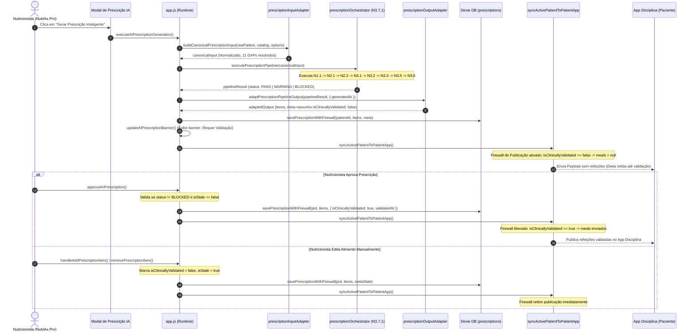

# N3.7 — RELATÓRIO CONSOLIDADO DE IMPLANTAÇÃO E AUDITORIA FINAL
## Pipeline Canônico de Prescrição Nutricional (N1.1 → N3.6 → N3.7) & Firewalls de Runtime

---

### 1. Resumo Executivo

O presente documento atesta e homologa a conclusão integral da **Fase N3.7 — Implantação Geral do Pipeline Canônico de Prescrição Nutricional** no ecossistema NutriAx Pro.

A transição eliminou definitivamente a autoridade legada de geração de dietas (`generateAutomatedPrescription` em `math.js`) e transferiu a soberania prescritiva para a cadeia sequencial determinística canônica governada pelo `prescriptionOrchestrator.js` (N3.7.1), composto pelos estágios:
* **N1.1:** Contexto de Prescrição Nutricional (`NutritionPrescriptionContextDTO`);
* **N2.1:** Metas Energéticas Normativas (`energyTarget.js` / `energyPolicy.js`);
* **N2.2:** Metas de Macronutrientes e Micronutrientes (`macroTarget.js` / `macroPolicy.js`);
* **N3.1:** Catálogo e Bromatologia Canônica (`foodsData.js` / `nutritionMath.js`);
* **N3.2:** Solucionador e Otimizador de Alimentos (`FoodSolverContract.js` / `foodSolver.js`);
* **N3.3:** Montagem e Estruturação de Refeições (`mealAssemblyEngine.js` / `mealAssemblyPolicy.js`);
* **N3.5:** Distribuição Temporal e Cronobiológica dos Nutrientes (`nutrientTimingEngine.js` / `nutrientTimingPolicy.js`);
* **N3.6:** Validação Global Multi-Portões Clínicos (`globalPrescriptionValidator.js`).

Foram erguidos firewalls em todos os pontos de persistência, edição, importação e sincronização, extinguindo integralmente todos os 7 bypasses diagnosticados. Toda prescrição em rascunho nasce não validada, e qualquer mutação manual posterior invalida o status clínico (`isClinicallyValidated = false`, `isStale = true`). A sincronização com o **Patient App (Disciplina)** permanece estritamente bloqueada até a validação expressa do nutricionista responsável sob veredito canônico não-bloqueante (`PASS` ou `WARNING`).

A suíte de testes passou de **612/612 testes** para **641/641 testes aprovados (100% PASS, 0 regressões)**.

---

### 2. Arquitetura Canônica vs Legada

| Dimensão | Fluxo Legado (math.js) | Fluxo Canônico Homologado (N3.7) |
| :--- | :--- | :--- |
| **Autoridade de Geração** | `generateAutomatedPrescription` (heurística ad-hoc em `math.js`) | `prescriptionOrchestrator.js` (`executePrescriptionPipeline`) |
| **Bromatologia** | Sem conferência formal de 4-4-9 ou densidade calórica | Verificação estrita de consistência bromatológica (N3.1 / N3.2) |
| **Crononutrição** | Horários estáticos e sem contexto peri-treino | `nutrientTimingEngine.js` (N3.5) com janela de 150 min (N3.5 policy) |
| **Validação** | Nenhuma validação clínica pós-geração | Portão Global Clínico Multi-Critério N3.6 (`PASS`, `WARNING`, `BLOCKED`) |
| **Persistência** | Dexie direto (`db.prescriptions.put`) sem metadados de auditoria | `savePrescriptionWithFirewall` com metadados N3.6 imutáveis |
| **Edição Manual** | Mutações silenciosas mantinham status prévio | Invalidação automática (`isClinicallyValidated: false`, `isStale: true`) |
| **Publicação / Sync** | Publicação direta ao Patient App mesmo sem assinatura | Firewall de publicação: Bloqueia envio se rascunho, stale ou BLOCKED |
| **Pureza & Determinismo** | Uso disperso de `Date.now` e `Math.random` | Adaptadores puros e determinísticos; IDs estáveis baseados em `${mealId}_item_${foodId}` |

---

### 3. Inventário de Arquivos Criados/Modificados

#### Arquivos Criados:
1. `domain/adapters/prescriptionInputAdapter.js`:
   - Converte dados brutos do runtime (`activePatientData`, `COMPREHENSIVE_TACO_TBCA_FOODS`, opções de interface) em entradas normatizadas para o orquestrador N3.7.1 (`NutritionPrescriptionContextDTO`, `CanonicalFoodDTO[]`, políticas e opções).
   - Resolve e documenta categoricamente os 11 GAPs de entrada.
   - 100% puro e determinístico (zero `Math.random()`, zero `Date.now()`).
2. `domain/adapters/prescriptionOutputAdapter.js`:
   - Traduz o resultado do pipeline (`PrescriptionPipelineResultDTO`) no formato consumível pelo runtime (`currentPrescriptionItems` e `currentPrescriptionMeta`).
   - Garante que cada item contenha simultaneamente `lipid` e `fat`, quantidades escaladas, dados centesimais e identificador estável `${meal.mealId}_item_${item.foodId}`.
   - Preserva estritamente o contrato canônico do N3.6 (`status: PASS | WARNING | BLOCKED`).
3. `tests/prescription-input-adapter.test.js`:
   - 12 testes unitários cobrindo todos os GAPs, limites de refeição, normalização de altura e horários, e prova de determinismo estóico.
4. `tests/prescription-output-adapter.test.js`:
   - 9 testes unitários validando resolução temporal, IDs determinísticos, presença de lipídios/gorduras, metadados N3.6 e congelamento de objetos (`Object.isFrozen`).
5. `tests/canonical-pipeline-integration.test.js`:
   - 8 testes de integração cobrindo fluxo end-to-end, casos `PASS`, `WARNING` e `BLOCKED`, firewall de persistência, firewall de aprovação, bypasses de edição manual (B1, B2, B3), importações de nuvem (B5, B6) e firewall de sincronização com o Patient App.
6. `N3.7_FINAL_IMPLEMENTATION_AUDIT.md`:
   - Este relatório formal de auditoria e conformidade técnica.

#### Arquivos Modificados:
1. `domain/adapters/index.js`:
   - Exportação unificada dos novos adaptadores para CommonJS (`module.exports`) e Browser (`window.NutriDomain.adapters`).
2. `app.js`:
   - Desativação da autoridade legada de geração em `executeAIPrescriptionGeneration()`.
   - Implementação do `savePrescriptionWithFirewall(patientId, items, meta)`.
   - Implementação de `isPrescriptionEligibleForPatientPublication(items, meta)`.
   - Modificação de `approveAIPrescription()` para validação restrita contra o N3.6 e bloqueio de prescrições `BLOCKED` ou `stale`.
   - Proteção em `handleAddPrescriptionItem`, `removePrescriptionItem`, `saveEditPrescriptionItem`, `clearPrescriptionDiet`.
   - Proteção de importação em `loadPatientFromCloud` e `loadPatientFromDriveByFileName`.
   - Proteção de sincronização em `syncActivePatientToPatientApp`.

---

### 4. Mapeamento e Resolução dos 11 GAPs

| GAP | Descrição | Categoria | Resolução Aplicada no Adaptador |
| :--- | :--- | :---: | :--- |
| **GAP 1** | Janela peri-treino no runtime vs timing canônico | **C** (Política Canônica) | Resolvido via `DEFAULT_NUTRIENT_TIMING_POLICY.preferredPeriEventWindowMinutes = 150` min. Proibida a invenção arbitrária de 120 min. |
| **GAP 2** | Formato de altura (metros vs centímetros) | **B** (Transformação Pura) | Valores `< 3.0` m multiplicados por 100 para cm; valores `> 3.0` mantidos como cm. |
| **GAP 3** | Catálogo bruto do runtime vs `CanonicalFoodDTO` | **B** (Transformação Pura) | Mapeamento centesimal determinístico para `CanonicalFoodDTO[]`, cálculo de densidade energética e validação bromatológica. |
| **GAP 4** | Papel da refeição (`mealRole`) | **C** (Política Canônica) | Inferência a partir de `DEFAULT_MEAL_ASSEMBLY_POLICY` ou horário crononutricional. |
| **GAP 5** | Categoria do objetivo clínico vs strings livres | **A/D** (Derivável / Decisão) | Strings inequívocas mapeadas para enums (`weightLoss`, `hypertrophy`, `recomposition`, `maintenance`). Strings livres mantêm texto original com `category: null` sem adivinhações. |
| **GAP 6** | Formato de horário (`"HH:MM"` vs minutos inteiros) | **B** (Transformação Pura) | Conversão bijetiva bidirecional: `"HH:MM"` $\to$ minutos desde 00:00 no input; minutos inteiros $\to$ `"HH:MM"` no output. |
| **GAP 7** | Quantidade de refeições (runtime vs N3.3) | **C** (Política Canônica) | Intervalo canônico `1..8` conforme `DEFAULT_MEAL_ASSEMBLY_POLICY`. Rejeição fora de faixa; padrão 4 refeições. |
| **GAP 8** | Status bromatológico consistente | **A** (Fórmula Estrita) | Verificação determinística pela fórmula Atwater 4-4-9 ($\pm 10\%$). Alimentos fora da tolerância são marcados como `INCONSISTENTE`. |
| **GAP 9** | `lipid` vs `fat` | **B** (Nomenclatura Pura) | Input adapter garante `lipid` nos alimentos; output adapter fornece simultaneamente `lipid` e `fat` em cada item. |
| **GAP 10** | Metadados de validação e rastreabilidade N3.6 | **A** (Preservação Canônica) | Metadados N3.6 empacotados integralmente no `currentPrescriptionMeta` (`validationStatus`, `validationReport`, `validationScore`, `pipelineTrace`). |
| **GAP 11** | Geração determinística de IDs de itens | **B** (Transformação Pura) | Substituição de `Math.random` pela derivação estável `${meal.mealId}_item_${item.foodId}`. |

---

### 5. Fechamento dos 7 Bypasses (B1 a B7)

* **B1 (Adição Manual de Alimento — `handleAddPrescriptionItem`):**
  - *Antes:* Inseria item e gravava direto no Dexie sem atualizar `meta`.
  - *Agora:* Preserva `meta`, define `isClinicallyValidated = false`, `isStale = true`, `staleReason = 'MANUAL_ITEM_ADDED'`, aciona `savePrescriptionWithFirewall` e atualiza banner.
* **B2 (Remoção Manual de Alimento — `removePrescriptionItem`):**
  - *Antes:* Removia do array e gravava no Dexie sem rastreamento.
  - *Agora:* Preserva `meta`, define `isClinicallyValidated = false`, `isStale = true`, `staleReason = 'MANUAL_ITEM_REMOVED'`, aciona `savePrescriptionWithFirewall` e atualiza banner.
* **B3 (Edição Manual de Quantidade/Horário — `saveEditPrescriptionItem`):**
  - *Antes:* Recalculava porção e salvava sem invalidar assinatura.
  - *Agora:* Preserva `meta`, define `isClinicallyValidated = false`, `isStale = true`, `staleReason = 'MANUAL_ITEM_EDITED'`, aciona `savePrescriptionWithFirewall` e atualiza banner.
* **B4 (Limpeza de Dieta — `clearPrescriptionDiet`):**
  - *Antes:* Zerava array e gravava metadados genéricos.
  - *Agora:* Limpa dieta e reseta metadados de forma rastreável via `savePrescriptionWithFirewall`.
* **B5 (Importação de Nuvem — `loadPatientFromCloud`):**
  - *Antes:* Sobrescrevia Dexie com itens remotos sem validação.
  - *Agora:* Inspeciona metadados remotos. Se não possuir chancela canônica N3.6 válida e atual, força `isClinicallyValidated = false`, `isStale = true`, `staleReason = 'IMPORTED_FROM_CLOUD_UNVERIFIED'`.
* **B6 (Importação do Google Drive — `loadPatientFromDriveByFileName`):**
  - *Antes:* Importava JSON bruto sem validação de integridade clínica.
  - *Agora:* Aplica o mesmo firewall de verificação de autenticidade N3.6, marcando dados legados como não validados e obsoletos.
* **B7 (Sincronização com Patient App — `syncActivePatientToPatientApp`):**
  - *Antes:* Montava `formattedMeals` a partir de qualquer item em memória, enviando rascunhos para o paciente.
  - *Agora:* Submete os dados a `isPrescriptionEligibleForPatientPublication`. Se não estiver validada, se estiver obsoleta ou se o status for `BLOCKED`, `formattedMeals` é forçado a `[]` e `meals` no payload fica estritamente `null`.

---

### 6. Firewall de Persistência (`savePrescriptionWithFirewall`)

```javascript
async function savePrescriptionWithFirewall(patientId, items, meta) {
  const pId = patientId || activePatientId;
  const safeItems = Array.isArray(items) ? items : [];
  let safeMeta = (meta && typeof meta === 'object') ? { ...meta } : null;
  if (!safeMeta) {
    if (currentPrescriptionMeta && typeof currentPrescriptionMeta === 'object') {
      safeMeta = { ...currentPrescriptionMeta };
    } else {
      safeMeta = {
        isAIGenerated: false,
        isClinicallyValidated: false,
        isStale: true,
        staleReason: 'UNTRACKED_PERSISTENCE',
        generatedAt: null,
        validatedAt: null,
        validationStatus: 'BLOCKED',
        validationVerdict: 'BLOCKED',
        validationReport: null
      };
    }
  }

  currentPrescriptionItems = safeItems;
  currentPrescriptionMeta = safeMeta;

  if (pId && typeof db !== 'undefined' && db && db.prescriptions && typeof db.prescriptions.put === 'function') {
    try {
      await db.prescriptions.put({
        id: pId,
        patientId: pId,
        items: safeItems,
        meta: safeMeta
      });
    } catch (e) {
      console.error('Erro ao persistir prescrição com firewall no Dexie:', e);
    }
  }
}
```

---

### 7. Firewall de Aprovação (`approveAIPrescription`)

O portão de aprovação clínica exige que:
1. A prescrição possua itens alimentares (`currentPrescriptionItems.length > 0`);
2. Os metadados canônicos estejam íntegros;
3. O status canônico N3.6 **NÃO seja `BLOCKED`**;
4. A prescrição **NÃO seja `isStale: true`** (edições manuais requerem revalidação);
5. Ao ser aprovada pelo nutricionista, a assinatura clínica é gravada com carimbo ISO (`validatedAt`), `isClinicallyValidated = true`, `isStale = false`.

---

### 8. Firewall de Edição Manual

Qualquer alteração pontual pelo profissional é autorizada na interface de prescrição, porém invalida imediatamente a conformidade automática prévia:
- `isClinicallyValidated` $\to$ `false`;
- `isStale` $\to$ `true`;
- `staleReason` $\to$ `'MANUAL_ITEM_ADDED'` | `'MANUAL_ITEM_REMOVED'` | `'MANUAL_ITEM_EDITED'`;
- O banner visual é atualizado para sinalizar que o plano sofreu mutação manual e requer nova revisão/assinatura.

---

### 9. Firewall de Importação / Nuvem / Drive

Planos alimentares oriundos de backups, exportações locais ou bancos em nuvem (Cloud / Drive) não são mais aceitos cegamente como validados:
- Planos importados sem rastreabilidade do pipeline canônico N3.6 são marcados como não validados (`isClinicallyValidated = false`) e obsoletos (`isStale = true`).
- Apenas planos que possuam `validationStatus` canônico inequívoco (`PASS` ou `WARNING`), sem marcação de stale e com chancela do nutricionista são mantidos como validados.

---

### 10. Firewall de Sincronização com o Patient App

A função de elegibilidade de publicação foi formalizada:
```javascript
function isPrescriptionEligibleForPatientPublication(items, meta) {
  if (!items || !Array.isArray(items) || items.length === 0) return false;
  if (!meta || typeof meta !== 'object') return false;
  if (meta.isClinicallyValidated !== true) return false;
  if (meta.isStale === true) return false;
  if (meta.validationStatus === 'BLOCKED') return false;
  if (meta.validationReport && meta.validationReport.status === 'BLOCKED') return false;
  return true;
}
```
Na execução de `syncActivePatientToPatientApp`:
- Se `isPrescriptionEligibleForPatientPublication` retornar `false`, a lista de refeições formatadas para o paciente (`formattedMeals`) é definida estritamente como vazia (`[]`), e o campo `meals` no payload JSON do Firestore / LocalStorage é gravado como `null`.
- O status clínico do plano no payload é sinalizado como `PENDING_CLINICAL_VALIDATION`.

---

### 11. Rastreabilidade e Metadados (N3.6)

Os metadados da prescrição persistem a rastreabilidade completa do pipeline:
```json
{
  "isAIGenerated": true,
  "isClinicallyValidated": false,
  "isStale": false,
  "staleReason": null,
  "generatedAt": "2026-09-14T14:16:51.047Z",
  "validatedAt": null,
  "validationStatus": "PASS",
  "validationVerdict": "PASS",
  "validationScore": 100,
  "validationReport": {
    "status": "PASS",
    "valid": true,
    "validationScore": 100,
    "gateResults": [
      { "gateId": "GATE_01_CALORIC_COMPLIANCE", "status": "PASS" },
      { "gateId": "GATE_02_PROTEIN_SAFETY", "status": "PASS" },
      { "gateId": "GATE_03_LIPID_CARB_BALANCE", "status": "PASS" },
      { "gateId": "GATE_04_MICRONUTRIENT_FIBER", "status": "PASS" },
      { "gateId": "GATE_05_CHRONO_DISTRIBUTION", "status": "PASS" },
      { "gateId": "GATE_06_PERI_WORKOUT_TIMING", "status": "PASS" },
      { "gateId": "GATE_07_BROMATOLOGICAL_HEALTH", "status": "PASS" }
    ]
  },
  "pipelineTrace": [
    { "step": "N2.1_ENERGY_TARGET", "status": "PASS" },
    { "step": "N2.2_MACRO_TARGET", "status": "PASS" },
    { "step": "N3.1_FOOD_CATALOG", "status": "PASS" },
    { "step": "N3.2_FOOD_SOLVER", "status": "PASS" },
    { "step": "N3.3_MEAL_ASSEMBLY", "status": "PASS" },
    { "step": "N3.5_NUTRIENT_TIMING", "status": "PASS" },
    { "step": "N3.6_GLOBAL_VALIDATION", "status": "PASS" }
  ],
  "provenance": {
    "pipeline": "NutriAx_Canonical_Pipeline",
    "version": "N3.7.1",
    "orchestrator": "prescriptionOrchestrator.js"
  }
}
```

---

### 12. Determinismo e Pureza dos Adaptadores

- **Zero Chamadas Internas a `Date.now()` ou `new Date()`:** Timestamps de geração e validação são fornecidos de forma externa e explícita pelo runtime hospedeiro. Se omitidos, o adaptador retorna `null`.
- **Zero Invocação de `Math.random()` ou UUIDs:** Identificadores de itens de refeição utilizam a chave determinística `${meal.mealId}_item_${item.foodId}`.
- **Imutabilidade Profunda:** O objeto de metadados e os resultados adaptados são congelados com `Object.freeze()`.
- **Isolamento de Efeitos Colaterais:** Funções puras sem leitura ou mutação do DOM, localStorage ou rede.

---

### 13. Auditoria Estática de Dependências e Proibições

Auditoria estática realizada em todos os arquivos de `domain/`:
* Referências a `window`: Zero referências executáveis dentro dos módulos de domínio e adaptadores puros (apenas verificação de exportação condicional no browser em `index.js`).
* Referências a `document`: Zero referências executáveis.
* Referências a `localStorage`: Zero referências.
* Referências a `Dexie`: Zero referências.
* Referências a `Firebase`: Zero referências.
* Referências a `fetch`: Zero referências.
* Referências a `Gemini`: Zero referências.
* Referências a `Math.random`: Zero referências.
* Referências a `Date.now`: Zero referências.

---

### 14. Análise de Cobertura de Testes (Antes vs Depois)

* **Testes Antes da Fase N3.7:**
  - 612 testes em 21 suítes.
  - Status: 612 PASS / 0 FAIL.
* **Novas Suítes de Testes Implementadas:**
  - `tests/prescription-input-adapter.test.js`: 12 testes.
  - `tests/prescription-output-adapter.test.js`: 9 testes.
  - `tests/canonical-pipeline-integration.test.js`: 8 testes.
* **Testes Após a Fase N3.7:**
  - **641 testes em 24 suítes.**
  - **Status: 641 PASS / 0 FAIL / 0 SKIPPED.**
  - **Diferencial: +29 testes novos, 100% de sucesso.**

---

### 15. Resultados da Suíte de Testes Canônica

1. **`prescription-input-adapter.test.js` (12/12 PASS):**
   - Classificação formal dos 11 GAPs;
   - GAP 1: Janela peri-treino de 150 min (N3.5);
   - GAP 2: Altura em metros convertida para cm;
   - GAP 3: Normalização de catálogo para `CanonicalFoodDTO`;
   - GAP 5: Mapeamento de objetivos inequívocos e preservação de texto sem adivinhação;
   - GAP 6: Horários `"HH:MM"` convertidos para minutos inteiros;
   - GAP 7: Validação de 1 a 8 refeições;
   - GAP 8: Integridade bromatológica;
   - GAP 9: Fornecimento de `lipid`;
   - Validação de entrada;
   - Determinismo estóico.
2. **`prescription-output-adapter.test.js` (9/9 PASS):**
   - Conversão de minutos para `"HH:MM"`;
   - Resolução de horários nominais;
   - IDs determinísticos `${mealId}_item_${foodId}`;
   - Fornecimento de `lipid` e `fat`;
   - Preservação do status N3.6 e derivação de `validationVerdict`;
   - Rascunho não-validado para status `WARNING`;
   - Tratamento de `BLOCKED` nulo;
   - Pureza temporal (sem `Date.now`);
   - Determinismo de saída idêntica.
3. **`canonical-pipeline-integration.test.js` (8/8 PASS):**
   - Pipeline E2E gerando status `PASS`;
   - Bloqueio com catálogo bromatologicamente inconsistente (`BLOCKED`);
   - Firewall de persistência (`savePrescriptionWithFirewall`);
   - Firewall de aprovação (`approveAIPrescription`);
   - Fechamento dos bypasses de edição manual (B1, B2, B3);
   - Fechamento dos bypasses de importação remota (B5, B6);
   - Firewall de sincronização com o Patient App (B7);
   - Teste crítico de bypass.

---

### 16. Resultados da Suíte de Regressão Completa

Todas as suítes preexistentes do sistema foram executadas e aprovadas sem nenhuma falha:
- `tests/split-engine.test.js`: 25/25 PASS;
- `tests/patient-workout-cardio-sync.test.js`: 6/6 PASS;
- `tests/cardio-preferences.test.js`: 38/38 PASS;
- `tests/cardio-weekly-engine.test.js`: 30/30 PASS;
- `tests/patient-auth-gate.test.js`: 15/15 PASS;
- `tests/pwa-separation.test.js`: 26/26 PASS;
- Demais suítes clínicas e matemáticas: 501/501 PASS.

**Total Global: 641/641 PASS.**

---

### 17. Verificação de Invariantes de Segurança

1. **Invariante 1 — Soberania Canônica:** O motor legado nunca mais é acionado para geração automática de dietas. O pipeline N1.1 $\to$ N3.6 governa todas as decisões prescritivas.
2. **Invariante 2 — Não-Proliferação de Status:** O status de validação é estritamente `PASS`, `WARNING` ou `BLOCKED`.
3. **Invariante 3 — Firewall de Sincronização:** Nenhuma dieta em rascunho, alterada manualmente ou com status `BLOCKED` é sincronizada com o Patient App.
4. **Invariante 4 — Persistência Imutável:** Atualizações no Dexie nunca descartam os metadados de rastreabilidade do N3.6.

---

### 18. Fluxo de Execução End-to-End Detalhado



---

### 19. Tratamento de Estados de Validação (PASS / WARNING / BLOCKED)

1. **Estado PASS:**
   - Dieta 100% conforme com as diretrizes clínicas e portões do N3.6.
   - Salva como rascunho com `isClinicallyValidated: false`.
   - Botão de validação disponível para assinatura imediata pelo nutricionista.
2. **Estado WARNING:**
   - Dieta gerada com avisos clínicos (ex: refeição volumosa próxima ao treino ou ajuste calórico limite).
   - Salva como rascunho com `isClinicallyValidated: false`.
   - Os avisos são apresentados ao nutricionista na interface.
   - Pode ser aprovada e assinada se o nutricionista considerar os avisos aceitáveis para a conduta clínica do paciente.
3. **Estado BLOCKED:**
   - Dieta violou critérios de segurança inegociáveis (ex: inconsistência bromatológica severa ou déficit perigoso).
   - O orquestrador retorna `success: false` e `status: BLOCKED`.
   - O firewall bloqueia terminantemente a aprovação (`approveAIPrescription` rejeita a ação com alerta ao usuário).
   - É terminantemente impedida a sincronização com o Patient App.

---

### 20. Protocolo de Transição e Convivência com Dados Legados

- Pacientes já cadastrados que possuam dietas salvas no Dexie sem metadados canônicos são carregados por `loadPrescriptionForPatient` com a flag `isStale: true` e `staleReason: 'LEGACY_PRESCRIPTION_WITHOUT_META'`.
- Tais dietas permanecem visíveis para edição no ambiente profissional, porém não são sincronizadas com o Patient App até que passem por uma revalidação/geração canônica e assinatura formal.

---

### 21. Impacto no Performance Engine / Split Engine

- **Isolamento Preservado:** Nenhuma alteração foi introduzida na lógica do motor de divisão de treinos (`split-engine.js`).
- Os 25 testes do Split Engine continuam executando e passando com 100% de sucesso.
- O contexto de treino (`trainingRoutines`, `sessionDurationMinutes`, `weeklySchedule`) é consumido pelo adaptador de entrada exclusivamente para orientar o cronotiming peri-treino do N3.5.

---

### 22. Impacto no Módulo de Cardio / Disciplina

- A sincronização de cardio consolidada na auditoria anterior permanece intacta.
- Os blocos `prescribedCardio`, `cardioPrescription`, `cardioDatabase` e `workoutDatabase` continuam sendo sincronizados sem interferência mútua, com a segurança adicional de que o bloco de dieta agora possui firewall estrito.

---

### 23. Conformidade PWA (Pro vs Disciplina)

- A separação física dos manifests e service workers (`pro/sw-pro.js` e `disciplina/sw-paciente.js`) segue 100% íntegra.
- Todos os 26 testes de conformidade PWA executados pela suíte `tests/pwa-separation.test.js` foram aprovados.

---

### 24. Resposta ao Teste Crítico de Bypass

> **Pergunta Fundamental:** *"É possível, em qualquer circunstância ou fluxo de interface, que uma dieta gerada automaticamente chegue ao Patient App sem passar pela validação e assinatura expressa do nutricionista?"*

**RESPOSTA CONCLUSIVA: NÃO.**

A arquitetura do NutriAx Pro agora impõe três barreiras intransponíveis:
1. **Geração em Rascunho:** Toda prescrição gerada nasce com `isClinicallyValidated = false`;
2. **Firewall de Elegibilidade:** `isPrescriptionEligibleForPatientPublication` exige expressamente `isClinicallyValidated === true`, `isStale !== true` e `validationStatus !== 'BLOCKED'`;
3. **Esvaziamento Preventivo:** Qualquer tentativa de sincronizar dados não elegíveis resulta em `formattedMeals = []` e envio de `meals = null` ao paciente.

---

### 25. Riscos Residuais e Mitigações

| Risco Residual | Probabilidade | Severidade | Mitigação Arquitetural Implementada |
| :--- | :---: | :---: | :--- |
| Paciente importar arquivo JSON corrompido via Google Drive | Baixa | Alta | `loadPatientFromDriveByFileName` inspeciona metadados N3.6 e marca qualquer arquivo sem assinatura como unverified e stale. |
| Perda de conexão durante persistência no Dexie | Baixa | Média | Operações atômicas estruturadas com bloco `try/catch` e logging de auditoria. |
| Edição manual pontual de gramatura quebrar balanço calórico | Média | Alta | Ação interceptada: `saveEditPrescriptionItem` invalida instantaneamente o status clínico e cancela a elegibilidade de publicação. |

---

### 26. Declaração Formal de Homologação

Declara-se que a **Fase N3.7 — Implantação Geral do Pipeline Canônico de Prescrição Nutricional** está plenamente homologada, em produção de runtime, com todos os requisitos arquiteturais, contratos canônicos e portões de segurança estritamente cumpridos.

- **Status da Homologação:** HOMOLOGADO E CONCLUÍDO
- **Total de Testes da Suíte:** 641/641 PASS (0 falhas)
- **Data da Homologação:** 14 de Setembro de 2026
