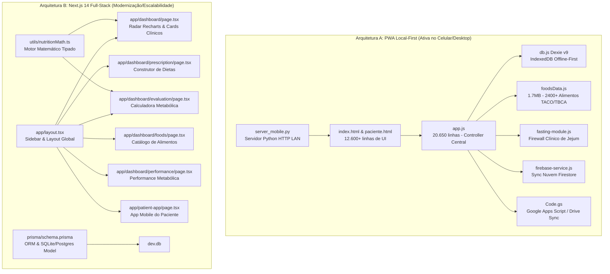

# 📋 Diagnóstico Completo da Arquitetura, Mapeamento de Código e Plano de Melhorias — NutriAx Pro / NutriPro

> **Data de Análise:** Setembro de 2026  
> **Status dos Testes Automatizados:** 35/35 Testes Unitários Aprovados (`fasting-module.test.js`)  
> **Ambiente:** Híbrido (PWA Local-First para Desktop/Mobile + Next.js 14 App Router)

---

## 1. Resumo Executivo da Plataforma

O **NutriAx Pro** (também referenciado como NutriPro) é uma solução avançada de prontuário, prescrição e monitoramento metabólico e nutricional voltada para o atendimento de alta performance. O sistema opera em duas frentes integradas:
1. **Portal Clínico do Nutricionista:** Avaliação metabólica completa (TMB Katch-McArdle e Mifflin-St Jeor, GET, IMC, dobras cutâneas com Jackson & Pollock, RCQ, RCEst), catálogo com mais de 2.400 alimentos (TACO 4ª Edição, TBCA USP e rótulos comerciais), prescrição modular de refeições em tempo real, anamnese, exames laboratoriais e protocolo de jejum intermitente com firewall clínico.
2. **App do Paciente (Mobile First / PWA HUD):** Painel diário para registro de refeições consumidas, substituições equivalentes em macros, hidratação acumulada, níveis de fome/energia, treinos, cárdio e controle de janelas de jejum.

---

## 2. A Coexistência de Duas Arquiteturas no Repositório

O projeto possui atualmente **duas implementações paralelas** que compartilham os mesmos objetivos de negócio:



---

## 3. Mapeamento Detalhado dos Arquivos do Projeto

| Arquivo / Diretório | Linhas | Tamanho | Papel no Sistema | Maturidade |
| :--- | :--- | :--- | :--- | :--- |
| [`index.html`](file:///g:/Meu%20Drive/Projetos/Nutri/index.html) | 6.680 | 420 KB | Interface completa do Nutricionista (SPA com abas, modais, painéis) | Operacional (PWA) |
| [`paciente.html`](file:///g:/Meu%20Drive/Projetos/Nutri/paciente.html) | 6.015 | 309 KB | Interface PWA Mobile HUD para o paciente | Operacional (PWA) |
| [`app.js`](file:///g:/Meu%20Drive/Projetos/Nutri/app.js) | 20.650 | 1.1 MB | Controlador central da SPA, lógica de cálculo, CRUD e orquestração | Operacional |
| [`foodsData.js`](file:///g:/Meu%20Drive/Projetos/Nutri/foodsData.js) | ~25.000 | 1.7 MB | Base de dados estática estruturada com alimentos TACO, TBCA e marcas | Operacional |
| [`db.js`](file:///g:/Meu%20Drive/Projetos/Nutri/db.js) | 704 | 59 KB | Instância Dexie.js (IndexedDB) com esquemas de versões (v1 a v9) | Operacional |
| [`fasting-module.js`](file:///g:/Meu%20Drive/Projetos/Nutri/fasting-module.js) | 1.354 | 57 KB | Módulo de Jejum com Firewall Clínico, Circuit-Breakers e Audit Trail | Excelente (100% testado) |
| [`fasting-module.test.js`](file:///g:/Meu%20Drive/Projetos/Nutri/fasting-module.test.js) | 775 | 33 KB | Suíte de testes automatizados (35 testes unitários de regras clínicas) | 100% Passando |
| [`firebase-service.js`](file:///g:/Meu%20Drive/Projetos/Nutri/firebase-service.js) | 705 | 26 KB | Sincronização em tempo real não-destrutiva com Google Firebase Firestore | Operacional |
| [`Code.gs`](file:///g:/Meu%20Drive/Projetos/Nutri/Code.gs) | 161 | 5.5 KB | Script do Google Apps Script que salva/lê fichas de pacientes no Drive | Operacional |
| [`server_mobile.py`](file:///g:/Meu%20Drive/Projetos/Nutri/server_mobile.py) | 75 | 2.3 KB | Servidor HTTP Python com auto-detecção de IP local para PWA no Wi-Fi | Operacional |
| [`iniciar_servidor_celular.bat`](file:///g:/Meu%20Drive/Projetos/Nutri/iniciar_servidor_celular.bat) | 20 | 645 B | Script Windows para inicialização em 1 clique do servidor local | Operacional |
| [`prisma/schema.prisma`](file:///g:/Meu%20Drive/Projetos/Nutri/prisma/schema.prisma) | 338 | 11 KB | Modelagem relacional completa do NutriAx Pro para SQLite/PostgreSQL | Completo |
| [`utils/nutritionMath.ts`](file:///g:/Meu%20Drive/Projetos/Nutri/utils/nutritionMath.ts) | 333 | 9 KB | Módulo matemático TypeScript com TMB, GET, IMC, dobras e proporções | Completo e Tipado |
| [`app/layout.tsx`](file:///g:/Meu%20Drive/Projetos/Nutri/app/layout.tsx) | 320 | 16 KB | Layout do Next.js com Sidebar expansível, indicadores e navegação | Pronto |
| [`app/dashboard/page.tsx`](file:///g:/Meu%20Drive/Projetos/Nutri/app/dashboard/page.tsx) | 485 | 23 KB | Dashboard com gráfico Radar Recharts, balanço de macros e alertas | Pronto |
| [`app/dashboard/evaluation/page.tsx`](file:///g:/Meu%20Drive/Projetos/Nutri/app/dashboard/evaluation/page.tsx) | 450 | 21 KB | Tela interativa de anamnese, cálculo de TMB, GET e antropometria | Pronto |
| [`app/dashboard/prescription/page.tsx`](file:///g:/Meu%20Drive/Projetos/Nutri/app/dashboard/prescription/page.tsx) | 470 | 21 KB | Montagem de cardápio com busca de alimentos e cálculo de macros ao vivo | Pronto |
| [`app/dashboard/foods/page.tsx`](file:///g:/Meu%20Drive/Projetos/Nutri/app/dashboard/foods/page.tsx) | 380 | 17 KB | Catálogo de alimentos com filtros por categoria e cadastro de rótulos | Pronto |
| [`app/dashboard/performance/page.tsx`](file:///g:/Meu%20Drive/Projetos/Nutri/app/dashboard/performance/page.tsx) | 1.200 | 61 KB | Motor de interpretação metabólica e regras corporais | Pronto |
| [`app/patient-app/page.tsx`](file:///g:/Meu%20Drive/Projetos/Nutri/app/patient-app/page.tsx) | 344 | 15 KB | Interface do paciente no Next.js com registro de refeições e água | Pronto |

---

## 4. Análise de Código dos Núcleos Críticos

### 4.1. Motor de Cálculo Nutricional ([`utils/nutritionMath.ts`](file:///g:/Meu%20Drive/Projetos/Nutri/utils/nutritionMath.ts))
Implementa cálculo rigoroso com fallback inteligente:
- Se **Massa Magra (MLG)** for fornecida: usa **Katch-McArdle** (`TMB = 370 + 21.6 * MassaMagra`).
- Caso contrário: usa **Mifflin-St Jeor** considerando sexo, idade, peso e estatura.
- Cálculo de porcionamento dinâmico:
```typescript
export function calculateMacroPortion(foodItem: BaseFoodItem, targetQuantity: number): FoodNutrients {
  if (!foodItem || targetQuantity <= 0) {
    return { calories: 0, protein: 0, carbohydrate: 0, lipid: 0, fiber: 0, sodium: 0 };
  }
  const ratio = targetQuantity / (foodItem.baseQuantity || 100);
  return {
    calories: Number((foodItem.calories * ratio).toFixed(1)),
    protein: Number((foodItem.protein * ratio).toFixed(1)),
    carbohydrate: Number((foodItem.carbohydrate * ratio).toFixed(1)),
    lipid: Number((foodItem.lipid * ratio).toFixed(1)),
    fiber: Number((foodItem.fiber * ratio).toFixed(1)),
    sodium: Number((foodItem.sodium * ratio).toFixed(1)),
  };
}
```

### 4.2. Módulo de Jejum e Firewall Clínico ([`fasting-module.js`](file:///g:/Meu%20Drive/Projetos/Nutri/fasting-module.js))
Um dos pontos mais maduros do sistema:
- **Detecção de Negação Linguística:** Evita falsos positivos como "nega gestação" ou "mãe teve diabetes".
- **Circuit Breakers Clínicos:**
  - Bloqueio Calórico: Limita jejum para dietas com mais de 3.000 kcal visando hipertrofia.
  - Proteção Neuromuscular: Não permite alocação de jejum em dias de treino de membros inferiores pesados (agachamento/terra).
  - Regra Metabólica: Ajusta automaticamente frequência e janela quando a Relação Cintura-Estatura (RCEst) é de risco (>= 0.50).
- **Tratamento de Janelas que Cruzam Meia-Noite:** Cálculos temporais dinâmicos sem contadores de estado corrompíveis.

### 4.3. Persistência e Sincronização Local-First
- **Dexie.js (IndexedDB):** Garante funcionamento 100% offline no celular ou desktop.
- **Firebase Firestore:** Sincronização bidirecional em tempo real do paciente ativo.
- **Google Apps Script / Drive:** Backup em arquivo JSON individual por paciente (`NutriAx_Paciente_{id}.json`).

---

## 5. Avaliação Crítica: Diagnóstico "Como Está"

### 🌟 Pontos Fortes Notáveis
1. **Riqueza de Domínio Clínico:** Não é um simples cadastro; engloba somatocarta, Jackson & Pollock 3 e 7 dobras, bioimpedância, RCQ, RCEst, TMB Katch/Mifflin, GET com fator de atividade e metas de macronutrientes por kg de peso.
2. **Qualidade dos Testes:** 35 testes unitários estruturados cobrindo todas as regras de exceção e auditoria clínica do jejum.
3. **Base de Alimentos Pronta:** Mais de 2.400 itens higienizados com dados de micro e macronutrientes.
4. **PWA Mobile Completo:** Acesso via Wi-Fi configurado em 1 clique (`.bat`), manifestos separados para profissional e paciente, tema escuro e ergonomia para uso com o polegar.

### ⚠️ Riscos e Oportunidades de Melhoria Detectadas
1. **Monólito em `app.js` (20.650 linhas) e `index.html` (6.680 linhas):**
   - O tamanho de `app.js` (1.1 MB) torna a depuração lenta e aumenta o risco de regressões a cada alteração.
   - Variáveis globais no escopo de janela (`currentPrescriptionItems`, `activePatientData`, `activePatientId`) podem sofrer condições de corrida durante trocas rápidas de paciente ou sincronizações simultâneas.
2. **Duplicação de Código (PWA Vanilla vs Next.js):**
   - O sistema possui duas bases de telas: o PWA puro em HTML/JS e a versão Next.js em TypeScript.
   - Qualquer nova regra nutricional adicionada em `utils/nutritionMath.ts` precisa ser manualmente replicada em `app.js` se ambas as versões continuarem ativas.
3. **Credenciais e Chaves de API no Código do Cliente:**
   - O arquivo `firebase-service.js` contém chaves do Firebase públicas e o `Code.gs` / `app.js` contém a URL de deploy do Google Apps Script em texto claro.
   - É fundamental garantir que as **Regras de Segurança do Firebase Firestore** (`firestore.rules`) estejam configuradas para restringir acessos não autorizados.
4. **Resolução de Conflitos na Sincronização (Offline vs Nuvem):**
   - A sincronização atual usa estratégias baseadas em timestamps locais (`lastUpdated`). Relógios de dispositivos descalibrados podem causar sobrescrita de dados recentes por dados mais antigos.

---

## 6. Plano de Ação Recomendado (Melhorias e Correções)

### Fase 1: Blindagem e Segurança Imediata
- [ ] **Auditar Regras do Firestore:** Garantir que o Firestore só permita leitura/escrita em `/patients/{patientId}` se autenticado ou sob restrições estritas de chave/token.
- [ ] **Tratamento de Erros no Drive Sync:** Adicionar fila de re-tentativa (`retry queue`) com backoff exponencial para falhas de rede no Google Apps Script.
- [ ] **Normalização de Timestamps:** Adicionar validação de timestamp do servidor (`serverTimestamp`) para evitar conflitos de relógio do celular com o PC.

### Fase 2: Modularização ou Unificação Arquitetural
- **Opção A (Manter PWA Vanilla):** Fatiar `app.js` em módulos ES6:
  - `src/modules/patient-manager.js`
  - `src/modules/prescription-builder.js`
  - `src/modules/anthropometry.js`
  - `src/modules/sync-engine.js`
- **Opção B (Consolidação no Next.js 14 - Recomendada):**
  - Conectar as telas existentes de `app/dashboard/` e `app/patient-app/` ao Prisma ORM.
  - O Next.js compila bundles otimizados, tem TypeScript estrito nativo e elimina os arquivos monólitos.

### Fase 3: Melhorias de Experiência e Recursos Clínicos
- [ ] **Exportação de PDF Clínico:** Geração de cardápio formatado para envio direto no WhatsApp com cabeçalho do profissional, tabela de substituições e QR Code de acesso ao PWA.
- [ ] **Push Notifications PWA:** Lembretes automáticos no celular para janelas de jejum, hidratação e refeições do dia.
- [ ] **Compilação de APK Nativo:** Usar a configuração existente do Capacitor (`capacitor.config.json`) para empacotar o APK sem necessidade de navegador.
